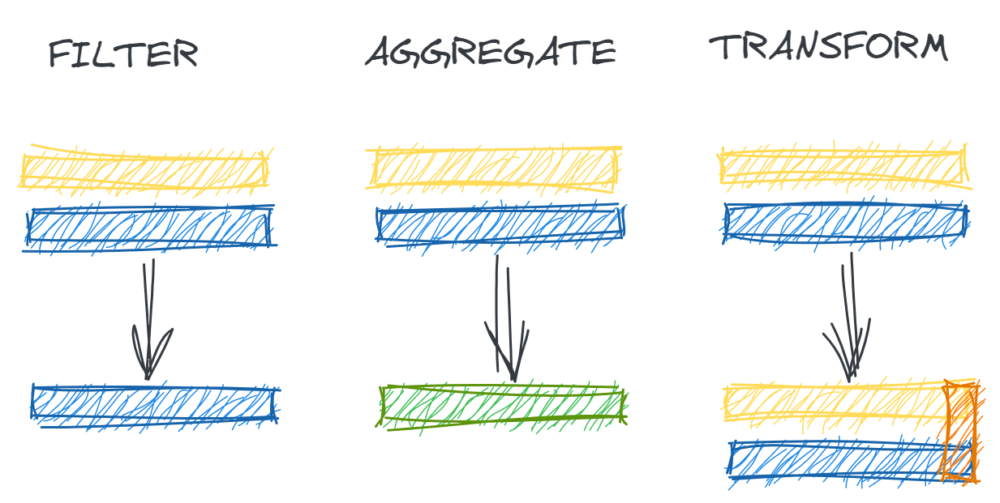
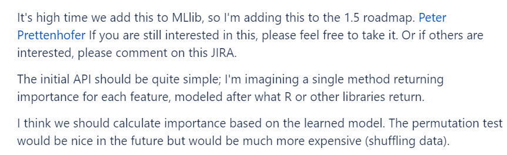

# Computational Quandaries (WIP) {#comp-quan}

After gaining confidence in one's data (or, at least, making peace with it), the next step in a data analysis is often to start cleaning and exploring that data with summary statistics, plots, and models. 
Generally, this requires a computational tool like SQL, R, or python. 

The process of computation itself can be fraught with challenges. 
Computational tools are extremely literal; they are excellent at doing *precisely what they were told to do* but not often what analysts might have *meant* or *wished* that they would do. 
Additionally, the moment an analyst begins to use a tool, the conversation is no longer between them and the data; 
suddenly, the mental model of how every single tool developer thought you might want to do analysis affects the tools' behaviors and the analysts' results.

In this chapter, we will explore common ways that tools may do something technically correct, reasonable, and as-intended but very much not what analysts may expect. 
Along the way, we will see how computational methods interact with the data encoding choices we discussed in Chapter \@ref(data-dall) (Data Dalliances).

```{r include = FALSE}
library(dplyr)
library(sqldf)
library(DBI)
library(RSQLite)
library(reticulate)

# make R dataset ----
registration <-
data.frame(
  ID_CUSTOMER = 1:10,
  CD_DEVICE = c(rep(1, 3), rep(2, 3), rep(3, 4)),
  AMT_SPEND = c(seq(10, 50, by=10), rep(NA, 3), 90, 100),
  AMT_RETURN = rep(NA, 10)
)

# load to SQL ----
con <- DBI::dbConnect(RSQLite::SQLite(), ":memory:")
DBI::dbWriteTable(con, "registration", registration)

# load to python ----
registration_py <- r_to_py(registration)
```

## Preliminaries - Data Computation

Before we think about specific tools or failure modes, we can first consider the common types of operations that the analytical tools allow us to do with our data. 

### Single Table Operations

Given a single data table, we may wish to do operations (illustrated in Figure \@ref(fig:filt-aggr-tran)) such as:

- **Filtering**: Extracting a subset of a dataset for analysis based on certain inclusion criteria for each record
- **Aggregation**: Grouping our data table by one or more variables and condensing information across records with *aggregate functions* like counts, sums, and averages 
- **Transformation**: Create new columns or modifying existing columns to represent more complex or domain-specific context

```{r filt-aggr-tran, echo = FALSE, out.width = '90%', fig.align = 'center', fig.cap = 'Illustration of basic single-table data wrangling operations'}

```

### Multiple Table Operations

Often, we can get additional value in an analysis by combining multiple types of information from difference tables. 
When working with multiple tables, we may be interested in:

- **Combining Row-wise**: Taking multiple tables with the same schemas (column names and data types) and creating a single table which contains the union (all records), intersection (only matching), or difference (only in one) of the records in the two tables
- **Combining Column-wise**: Appending additional fields to existing records through joining (also known as merging) multiple tables 

### Mechanics

All of these operations rely on a few core computational tasks:

- **Arithmetic**: Basic addition, subtraction, multiplication, and division to aggregate and transform data
- **Equality**: Comparing whether or not two values are equal is critical for data filtering, column-wise combination, and certain types of data transformation 
- **Casting**: Converting data types of different elements into a comparable format is necessary for row-wise combination and often a prerequisite to certain equality and arithmetic tasks

While these operations may seem simple, their behavior within certain tools and when employed for certain data types may sometimes lead to unintuitive or misleading results. 

## Null Values

In Chapter \@ref(data-dall) (Data Dalliances), we discuss how null values may represent many different concepts and be encoded in multiple different ways. 
In addition to those semantic challenges, various representations of null values may cause different computational problems.^[This problem is not isolated to data analysis tools. For an entertaining example, see the 2019 WIRED article "How a 'NULL' License Plate Landed One Hacker in Ticket Hell" [@barrett] which a real-world software system producing unintended and undesirable behavior when asked to deal with a word `'NULL'`.] 
In this section, we will explore these potential failure modes. 

### Types of Null Values

Not only can null values represent many different things (as explored in Chapter \@ref(data-dall)), they also may be represented in many different ways. Understanding how nulls are encoded in one's dataset is a critical prerequisite to attempting any of the computations described in the subsequent sections.

#### Language representations 

Different programming languages each offer their own versions of null values -- and sometimes more than one. For example, the R language includes `NA`, typed `NA`s (e.g. `NA_integer`, `NA_character`), `NaN`, and `NULL`; meanwhile, core python has `None` and the `numpy` module provides a `nan`. 

These different values carry different semantic and functional meanings. For example R's `NA` generally means "the presence of an absence" whereas `NULL` is "the absence of a presence". This is articulated more clearly if we examine the lengths of these objects and observe that `NA` has a length 1 whereas `NULL` has a length 0.

```{r}
c(length(NA), length(NULL))
```

As further proof that these are not interchangeable, we may use the helper functions `is.na()` and `is.null()`. It's false that `NA` is `NULL` and essentially unable to be evaluated if `NULL` is `NA` because `NULL`s are truly nothing.^[You'll notice that the code chunk below contains four inputs but only three outputs. Why is that? `is.na(NULL)` returns `logical(0)`, a zero-length value which cannot be stored in the vector. It's yet another form of missingness!]

```{r}
c(
  is.na(NA),
  is.null(NULL),
  is.na(NULL),
  is.null(NA)
)
```

To further complicate matters, we have `NaN` ("not a number"), along with `-Inf` and `Inf`, which generally arise when we attempt to abuse R's calculator. Somewhat charmingly, `Inf` and `-Inf` may be used in some rudimentary calculations where the limit is returned.^[From calculus, we know 1/Inf approaches 0, but Inf/Inf is undefined.]

```{r}
c(
  1/0,   # returns Inf
  0/0,   # returns NaN
  1/Inf  # returns 0
)
```

#### Data encoding choices (TODO)

Beyond these null types offered natively by different programming languages, there are also many different data management *conventions* for null values. Because null values can have many meanings, sometimes missing fields are encoded with "out of range" values which intend to suggest a type of missingness. 

For example, the US Census Bureau's Medical Expenditure Panel Survey uses the following reserved codes to denote different types of missingness: (TODO: cite p10 https://www.meps.ahrq.gov/data_stats/download_data/pufs/h206a/h206adoc.pdf)

```
- -1 INAPPLICABLE Question was not asked due to skip pattern
- -7 REFUSED Question was asked and respondent refused to answer question
- -8 DK Question was asked and respondent did not know answer
- -14 NOT YET TAKEN/USED Respondent answered that the medicine has not yet been used
- -15 CANNOT BE COMPUTED Value cannot be derived from data
```

This approach preserves a lot of relevant information while, at the same time, being readily apparent that these values are not valid when the data is manually inspect. Unfortunately, manually inspecting every data field is rarely possible, and such sentinel values may go undetected when looking at higher-level summaries.

Consider a survey of a population of retired adults where age is coded as `999` if not provided. Below, we simulate 100,000 such observations that are uniformly distributed between the age of 65 and 95 (hence, have an expected value of 80). Next, we replace merely *half of a percent* with our "null" values of `999`. Taking the mean with these false values results in a mean of about 85. This number alone might not raise the alarm; after all, we know the dataset's population is older adults. However, accidentally treating these as valid values biases our results by a somewhat remarkable five years.
 
```{r}
set.seed(123)

n <- 100000
p <- 0.005
ages <- runif(n, 65, 95)

ages_nulls <- ages
ages_nulls[1:(n*p)] <- 999

c(mean(ages), mean(ages_nulls))
```

So, the first order of business with null values is understanding how they are encoded and translation them to the most computationally appropriate form. However, that is only the beginning of the story.

### Aggregation

How null values are handled in the simple aggregation of data varies both across different languages and across different functions within a language. 
To better understand the problems this might cause, we will look at examples in R and SQL.

To explore aggregation, let's build a simple dataset. We will suppose that we are working with a subscription-based e-commerce service and that we are looking at a `monthly_spend` dataset with one record per customer and information about the amount they spent and returned in a given month:

```{r}
spend <-
  data.frame(
    AMT_SPEND = c(10, 20, NA),
    AMT_RETURN = rep(NA, 3)
  )
```

```{r include = FALSE}
# load to SQL ----
con <- DBI::dbConnect(RSQLite::SQLite(), ":memory:")
DBI::dbWriteTable(con, "spend", spend)
```

To compute the average amount spent (`AMT_SPEND`) with the `dplyr` package, an analyst might first reasonably write the following `summarize()` statement. 
However, as we can see, due to the presence of null values within the `AMT_SPEND` column, the result of this aggregation is for the whole quantity of `AVG_SPEND` to be set to the value `NA`. 

A glance at the documentation for the `mean()` function reveals that it has an `na.rm` parameter which, when set to true, removes null values from our dataset. 
Adding this argument to the previous statement allows us to reach a numerical answer.

```{r}
summarize(spend, 
          AVG_SPEND = mean(AMT_SPEND),
          AVG_SPEND_NARM = mean(AMT_SPEND, na.rm = TRUE))
```

However, is this the *right* numerical answer? 
What `na.rm = TRUE` does is *drop* the null values from the set of numbers being averaged. 
However, suppose the null values represent that no purchases were made. 
That is, zero dollars were spent. 
In effect, we have removed all non-purchasers from the data being averaged. 

More precisely, we have switched from taking the average

\[ \frac{ \sum_{1}^{n} Spend }{\sum_{1}^{n} 1} \] over all $n$ customers

to taking the average

\[ \frac{ \sum_{Spend > 0} Spend }{\sum_{Spend > 0} 1} \] over only those customers with spend

At face value, we could say that the code above is giving the incorrect answer; by dropping some low (zero) purchase amounts, the average amount spend per customer is inflated. 
A second perspective, which is someone more philosophically troubling, is that this tiny change to the code which fixed the *obvious* problem (returning a null value) has introduced a *non-obvious* problem by fundamentally changing the question that we are asking. 
By dropping all accounts from our table who made no purchases, we are no longer answering "What is the average amount spent by a new registrant?" but rather "What is the average amount spent by an actively engaged customer?" 
This technical quirk has significant analytical impact.

To answer the real question at hand, we would instead have a couple of options. 
We could manually `sum()` the amount spent with the option to drop nulls but then divide by the correct denominator (all observations -- not just those with spend) or we could explicitly recode null values in `AMT_SPEND` to zero before taking the average.^[Recoding can be done with a number of different general purpose functions like `ifelse` or `dplyr::case_when` in R. Different SQL varaints often offer different options for this purpose with functions such as `nvl()` or `zeroifnull()`. A common version across many platforms is `coalesce()` which takes the first non-null argument listed.]
Either of these options lead to the correct conclusion of a lower average spend amount.

```{r}
summarize(
    spend,
    AVG_SPEND_MANUAL = sum(AMT_SPEND, na.rm = TRUE) / n(),
    AVG_SPEND_RECODE = mean(coalesce(AMT_SPEND, 0))
  )
```

This is all well and good if we could just accept that the behaviors above are simply how nulls work, but further complexity comes as we see that there is no industry standard across tools. 
For example, as the SQL code below shows, SQL's `avg()` function behaves more like R's `mean()` *with* the `na.rm = TRUE` option set. 
That is, the default behavior of SQL is to only operate on the valid and available values. 

```{sql connection = con, output.var = "sql1"}
SELECT avg(amt_spend) as AVG_SPEND
FROM spend
```

```{r echo = FALSE}
sql1
```

However, this is not to suggest that null values cannot also be destructive in SQL. 
While aggregation functions (which compute over the *rows/records*) like `sum()` and `avg()` drop nulls, operators like `+` and `-` (which compute *across columns/variables* in the *same row/record*) do not exhibit the same behavior. 
Consider, for example, if we wish to calculate the average net purchase amount (purchases minus returns) instead of the gross (total) purchase amount. 

```{sql connection = con, output.var = "sql2"}
SELECT avg(amt_spend-amt_return) as AVG_SPEND_NET
FROM spend
```

```{r echo = FALSE}
sql2
```

Despite what we learned above about SQL's `avg()` function, the query above returns only a null value. 
What has happened? 
In our `spend` dataset, the `amt_return` column is completely null (representing no returns). 
Because the subtraction occurs before the average is taken, subtracting real numbers in `amt_spend` with null values in `amt_return` creates a column of all null values which are then fed into the `avg()` function. 
This process is shown step-by-step below.

```{sql connection = con, output.var = "sql3"}
SELECT
  amt_spend, 
  amt_return, 
  amt_spend-amt_return 
FROM spend
```

```{r echo = FALSE}
sql3
```

### Comparison

Null values don't just introduce complexity when doing arithmetic. Difficulties also arise any time multiple variables are assessed for equality or inequality. Since a null value is unknown, most programming languages generally will *not* consider nulls to be comparable with other nulls. 

We can simple examples of this in both R and SQL.

```{r}
c(
  NA == 3, 
  NA > 10, 
  NA == NA
  )
```

```{sql connection = 'con', output.var = "sql4"}
SELECT
  (NULL = 3) as NULL_EQ_NUM,
  (NULL > 10) as NULL_GT_NUM,
  (NULL = NULL) as NULL_EQ_NULL
```

```{r echo = FALSE}
sql4
```


In these toy examples, such outcomes may seem perfectly logical. 
However, this same reasoning can arise in sneakier ways and lead to uninteded results when equality evaluations are *implicit* in the task at hand instead of the singular focus. 
We'll now see examples from data filtering, joining, and transformation.

#### Filtering

Suppose we want to split our dataset into two datasets based on high or low values of spend. 
We might assume the following two lines of code will create a clear partition^[A **paritition** of our data would imply that every record is contained in precisely one group] of results.

```{r}
spend_lt20 <- filter(spend, AMT_SPEND < 20)
spend_gte20 <- filter(spend, AMT_SPEND >= 20)
```

However, examining the resulting datasets, we see than *neither* contains the null records.  

```{r}
spend_lt20
spend_gte20
```

The same situation results in SQL.

```{sql connection = con, output.var = "sql4"}
SELECT *
FROM spend
WHERE AMT_SPEND < 20
```

```{r echo = FALSE}
sql4
```

```{sql connection = con, output.var = "sql5"}
SELECT *
FROM spend
WHERE AMT_SPEND >= 20
```

```{r echo = FALSE}
sql5
```

Thus, whenever our data has null values, the very common act of data filtering risks excluding important information.

#### Joining

The same phenomenon as described above also happens when joining multiple datasets. 

Suppose we have multiple datasets we wish to merge based on columns denoting a record's name and date of birthday. 
For ease of exploration, we will make the simplest possible such dataset and simply try to merge it to itself. 
(This may seem silly, but often when trying to understand *computationally* complex things, it is a good idea to make the scenario as simple as possible.
In fact, this idea is core to the concept of computational unit tests which we will discuss at the end of this chapter.)

```{r}
bday <- data.frame(NAME = c('Anne', 'Bob'), BIRTHDAY = c('2000-01-01', NA))
bday
```

```{r include = FALSE}
# load to SQL ----
DBI::dbWriteTable(con, "bday", bday)
```

In SQL, if we try to join this table, the records in row 1 will match because `'Anne' == 'Anne'` and `'2000-01-01' == '2000-01-01'`. 
However, poor Bob's record is eliminated because his birthdate is logged as null, and `NA == NA` is false.

```{sql connection = "con", output.var = "sql6"}
SELECT a.*
FROM
  bday as a
  INNER JOIN
  bday as b
  ON
  a.NAME = b.NAME and
  a.BIRTHDAY = b.BIRTHDAY
```

```{r echo = FALSE}
sql6
```

In contrast, R's `dplyr::inner_join()` function will not do this by default. 
This function lets us specifically control how nulls are matches with the `na_matches` argument, with a default option to match on `NA` values. 
(You may read more about the argument by typing `?dplyr::inner_join` in the R console to pull up the documentation.)

```{r}
inner_join(bday, bday, by = c('NAME', 'BIRTHDAY'))
```

This example then is not only a cautionary tale for how null values may unintentionally corrupt our data transformations but also how "brittle" our knowledge and intuition may be when moving between tools.
Neither of these default behaviors is strictly better or worse, but they are definitely different and have real implications on our analysis.

#### Transformation

A common task in data analysis is to aggregate results by subgroup. 
For example, we might want to summarize how many customers (rows/records) spent more or less than $10. To discern this, we might create a categorical variable for high versus low purchase amounts, group by this variable and count.

The psuedocode would read something like this:

```{r eval = FALSE}
data %>%
  mutate(HIGH_LOW = << transform AMT_SPEND >>) %>%
  group_by(HIGH_LOW) %>%
  count()
```

To define the `HIGH_LOW` variable, we might use a function like `ifelse()`, `dplyr::if_else()`, or `dplyr::case_when()`. 
However, once again, we have the issue of how values are *partitioned* when nulls are included. 
If we recode any records with `AMT_SPEND` of less than or equal to 10 to "Low" and default the rest to "High", we will accidentally count all null values in the "High" group.

```{r}
spend %>%
  mutate(HIGH_LOW = case_when(
    AMT_SPEND <= 10 ~ "Low", 
    TRUE ~ "High")
    ) %>%
  group_by(HIGH_LOW) %>% 
  count()
```

Instead, it is more accurate and transparent (unless we know specifically what null values mean and what group they should be part of) to not let one of our "core" categories by the "default" case in our logic. 
We can explicitly encode any residual values as something like "OTHER" or "ERROR" to help us see that there is a problem requiring extra attention.

```{r}
spend %>%
  mutate(HIGH_LOW = case_when(
    AMT_SPEND <= 10 ~ "Low", 
    AMT_SPEND > 10 ~ "High",
    TRUE ~ "OTHER")
    ) %>%
  group_by(HIGH_LOW) %>% 
  count()
```

## Dates and Times (TODO)

## Strings (TODO)

## Encoding Choices (TODO)

## Order of Operations (TODO)

## Object References (TODO)

## Trusting Tools

### Delegating decisions

A theme throughout this book is the fundamentally *social* nature of data analysis. Data analysis is fraught without understanding the countless decisions made along the way by those who generated it (whose data is reflected), those who collected it, those who migrated it, and those who have posed questions of it. On one hand, this is a beautiful aspect of analysis; on the other hand, it means that analysts and their analyses are subject to all of the cognitive and social psychological biases of everyday humans.

One such bias is "social proof": assuming that if a tool behaves a certain way, it must be because it is correct. 

Assuming that our tools know best is admittedly an attractive proposition. It appeals to a desire to think that someone, somewhere is "in charge" and, perhaps more critically, helps us avoid a domino effect of distrust (If we *don't* trust our tools how can we trust our results? And if we can't trust our results, how can we trust anything at all?) Unfortunately, there are many reasons are tools might not know best. For example, the tool's developer might have:

- Made a mistake
- Had a different analysis problem in mind with a different optimal approach
- Been optimizing for a different constraint (e.g. explainability vs. accuracy, speed vs. theoretical properties)
- Come from a community with different norms
- Been affording users the flexibility to do things many ways even if they don't agree
- Built a certain feature for a different purpose than how you are using it
- Not thought about it at all

As a few concrete examples from popular open source tools. We'll look briefly at the prominent python library `scikitlearn` for machine learning and Apache Spark, an engine for large-scale distributed data processing.

#### Defaults in `scikitlearn`

`scikitlearn`'s default behavior for logistic regression modeling^[A classic modeling technique for predicting binary (yes/no) outcomes] automatically applies L2 regularization. You might or might not know what this means, and you might or might not want to apply it to your problem. That's fine. The important thing is that it *will* change your estimates and predictions, and it is *not* a part of the classical definition of that algorithm (for modelers coming from a statistical background.) 

Of course, there's nothing inherently wrong about this choice; the library authors just had different goals than a typical statistical. `scikitlearn` developer Olivier Grisel explains [on Twitter](https://twitter.com/ogrisel/status/1167438229655773186?s=20) that this choice (and others in the library) is explained because "Scikit-learn was always designed to make it easy to get good predictive accuracy (eg as measured by CV) rather than as statistical inference library." Additionally, this choice is documented in bold [in the function documentation](https://scikit-learn.org/stable/modules/generated/sklearn.linear_model.LogisticRegression.html). 

However, an analyst could easily miss this nuance if they do not *read* the documentation. Or, if they *misinterpret* this choice as social proof that regularization is always the right approach, they might not make the best choice for their own analysis.

#### Algorithms in `Spark`

As a second example, according to a 2015 [Jira ticket](https://issues.apache.org/jira/browse/SPARK-5133), developers of Spark considered multiple methodologies they could use when adding the functionality to compute feature importance for a random forest. Ultimately, a core contributor advised against permutation importance due to its computational cost. 

```{r echo = FALSE, out.width = '90%', fig.align = 'center', fig.cap = "JIRA ticket for Spark with a discussion of which random forest variable importance algorithm to implement"}

```

Clearly, no one wants a workflow that is too costly or timely to run. So, once again, there is no right or wrong. However, since every approach to feature importance has its own biases, pitfalls, and challenges in interpretation, it's a mistake for an end-user to not carefully understand which algorithm is used and why.

### Security (TODO)

namespace squatting
executable code

## Strategies (TODO)

## Real World Disasters (TODO)

<!--

In practice, data analysis requires using a number of advanced computational tools such as SQL, R, or python. Analysts must work in a partnerships with each tool to access and wrangle their data into an accessible form of information. However, the moment you as an analyst begins to use a tool, the conversation is no longer simply between you and the data; suddenly, thousands of developers who helper build your tools are now crowding into the room. Each may have contributed to the code behind your tool with a different mental model of how one would use it.

In this chapter, we will explore common ways that tools may do something correct, reasonable, and as-intended but very much not what we would have liked as analysts.

```{r include = FALSE}
library(dplyr)
library(sqldf)
library(DBI)
library(RSQLite)
library(reticulate)

# make R dataset ----
registration <-
data.frame(
  ID_CUSTOMER = 1:10,
  CD_DEVICE = c(rep(1, 3), rep(2, 3), rep(3, 4)),
  AMT_SPEND = c(seq(10, 50, by=10), rep(NA, 3), 90, 100),
  AMT_RETURN = rep(NA, 10)
)

# load to SQL ----
con <- DBI::dbConnect(RSQLite::SQLite(), ":memory:")
DBI::dbWriteTable(con, "registration", registration)

# load to python ----
registration_py <- r_to_py(registration)
```

TODO: Introduce datasets

```{r}
head(registration)
```

```{python}
1+1
```


## Understanding data table structure

Understanding the content and structure of the data you are using is a critical prerequisite to analysis. In this book, we focus on tabular, structured data like one might find in an Excel spreadsheet or relational database.^[Other types of data that one might encounter in the wild include free text, JSON, spatial data, and more. However, many of these require either more advanced analysis techniques or structuring that converts them into tabular data, so they are out of the scope of this discussion.] 

In particular, many tools work best with what R developer Hadley Wickham descibes as "tidy data" [@wickham_tidy]. Namely:

1. Each variable forms a column
1. Each observation forms a row
1. Each type of observational unit forms a table

This is analogous to how one generally finds data arranged in a database and how statisticians are used to conceptualizing it. For example, the design matrix of a linear model consists of one column of data for each independent variable to be included in the model and one row for each observation.^[When data is arrange this way in a matrix $X$, linear regression coefficients can be computed as $\beta = (\mathbf{X}^\intercal\mathbf{X})^{-1}\mathbf{X}^\intercal \mathbf{y}$]


Tidy data [@wickham_tidy]

Things you need to know:

- Data **columns**/**variables** - what do they mean (don't assume from name!)
- Field **encodings** - what do subfields mean and what are their limits?
- Data **rows** - what is a unique observation? 
- Data **granularity** - when is it refreshed? How deep does it look when it's refreshed?

Strategies:

- Data dictionaries
- Business rule checks
- Consult with experts

## The meaning of a row

Often, data comes with an accompanying data dictionary to describe the meaning of each variable (column). However, for some reason, describing what constitutes an observation (row) is less common practice. This may seem obvious. In two of R's most popular built-in datasets, `iris` and `mtcars`, it's somewhat evident from context that each row represents one flower or one car. 

However, sometimes trying to glean this information from context alone can be misleading. Imagine, for example, that we want to calculate the rate of successful log-ins to our e-commerce website.

```{r echo = FALSE}
library(tidyr)
library(dplyr)

set.seed(123)
data <- data.frame(ID_ACCT = 1:10, N_ATTEMPT = sample(1:3, 10, replace = TRUE, prob = c(0.7, 0.2, 0.1)), IND_LOGIN = rep(1,10))
logins <-
tidyr::uncount(data, N_ATTEMPT, .remove = FALSE) %>%
  group_by(ID_ACCT) %>%
  mutate(IND_LOGIN = case_when(
    N_ATTEMPT > 1 & row_number() < N_ATTEMPT ~ 0,
    N_ATTEMPT > 1 & row_number() == N_ATTEMPT ~ sample(c(0,1), 1, replace = TRUE, prob = c(0.6,0.4)),
    TRUE ~ IND_LOGIN
  )) %>%
  select(-N_ATTEMPT) %>%
  ungroup()
```

```{r}
summarize(logins, PROP_LOGIN = mean(IND_LOGIN))

logins %>%
  group_by(ID_ACCT) %>% 
  summarize(IND_LOGIN = max(IND_LOGIN)) %>%
  ungroup() %>% 
  summarize(PROP_LOGIN = mean(IND_LOGIN))
```

## The many forms of null

Frequently, real-world data sets suffer from at least some missing values. This missing data can cause complex computational and analytical challenges. Considering why one's data is missing and how such missing is encoded is critical before attempting an analysis.

It's tempting to think of missingness as a binary status: either a datum exists or it does not. However, missingness can arise from a number of different situations -- each with its own unique computational and analytical challenges. For example, in a tabular data representation, a variable (column) for an observation (row) might appear to be missing because:

- There exists a true value for that variable and entity but it is unknown
- There is no relevant value for that variable
- The relevant value for that variable *is* null

For example, consider the `registrations` dataset with data on users that have created an account at an online e-commerce platform:

- Users might be asked but not required to provide their date of birth; so, while every user *has* a birthday, only those that provide it would have a value for this field. Those that do not would be encoded as a `NULL`; (could also be only started collecting after certain dates, at a certain set of stores, data load error)
- We might also wish to record for mobile users if they were on an Android or and iPhone device when they registered. However, for users registering from a computer, there is no relevant value for this field. 
- Often, retailers want to attribute user traffic to different forms of advertising, so we might also have a field for the URL that directed users to our site. However, for users that truly typed in the URL directly and did not come through an affiliate link, the "true value" of the referring site is `NULL`. (Admittedly, there is significant overlap in the second two cases.)

Just as there are many potential causes for missingness in our data, there can often be many potential *encodings* of missingness.

The **naniar** package [@R-naniar] \index{R package!naniar}

Talk about encoding as like 9999

R has `NA`, `NaN`, `Inf`, `NULL`, and typed `NA`s

While this section focuses on the computational challenges of null values, no discussion of missingness would be complete without also mentioning the analytical consequences as well. Many statistical techniques such as linear regression are unable to accept null values in their inputs, so an analyst must somehow confront missingness before passing their data to the algorithm. Broadly speaking, analysts must either remove missing values or replace them with a proxy imputed value. There is a rich literature on missingness beyond the scope of this book, but briefly speaking this choice can be guided by the following framework. 

These different types of missingness must be handled differently because they insert different biases into our data. Someone (TODO: who and add citiation) classifies the level of missingness as:

- Missing Completely at Random (MCAR): TODO: finish defining these
- Missing at Random (MAR):
- Missing not a Random (MNAR):

Comparing these categories to the examples above, 

Literature about imputation; mention **mice** package (???)

One example of this is evident in the US Census Bureau's Medical Expenditure Panel Survey which uses the following reserved codes to denote different types of missingness. (TODO p10 https://www.meps.ahrq.gov/data_stats/download_data/pufs/h206a/h206adoc.pdf)

- -1 INAPPLICABLE Question was not asked due to skip pattern
- -7 REFUSED Question was asked and respondent refused to answer question
- -8 DK Question was asked and respondent did not know answer
- -14 NOT YET TAKEN/USED Respondent answered that the medicine has not yet been used
- -15 CANNOT BE COMPUTED Value cannot be derived from data

## Null value aggregation

As we've seen, null values in our data can mean many different things and be represented in many different ways. However, even once we have locked down the *semantic* meaning of nulls in our data and considered alternatives for their *encoding*, these values may still cause *computational* challenges.^[This problem is not isolated to data analysis tools. For an entertaining example, see the 2019 WIRED article "How a 'NULL' License Plate Landed One Hacker in Ticket Hell" [@barrett] which a real-world software system producing unintended and undesirable behavior when asked to deal with a word `'NULL'`.] How null values are handled in the simple aggregation of data varies both across different languages and across different functions within a language. To better understand the problems this might cause, we will look at examples in R and SQL.

First, consider the `registration` data set. To compute the average amount spent (`AMT_SPEND`) with the `dplyr` package, an analyst might first reasonably write the following `summarize()` statement. However, as we can see, due to the presence of null values within the `AMT_SPEND` column, the result of this aggregation is for the whole quantiaty of `AVG_SPEND` to be set to the value `NA`. 

```{r}
summarize(registration, AVG_SPEND = mean(AMT_SPEND))
```

A glance at the documentation for the `mean()` function reveals that it has an `na.rm` parameter which, when set to true, removes null values from our dataset. Adding this argument to the previous statement allows us to reach a numerical answer.

```{r}
summarize(registration, 
          AVG_SPEND = mean(AMT_SPEND, na.rm = TRUE))
```

However, is this the *right* numerical answer? What `na.rm = TRUE` does is *drop* the null values from the set of numbers being averaged. However, suppose the null values represent that no purchases were made. That is, zero dollars were spent. In effect, we have removed all non-purchasers from the data being averaged. 

More precisely, we have switched from taking the average

\[ \frac{ \sum_{1}^{n} Spend }{\sum_{1}^{n} 1} \] over all $n$ customers

to taking the average

\[ \frac{ \sum_{Spend > 0} Spend }{\sum_{Spend > 0} 1} \] over only those customers with spend

At face value, we could say that the code above is giving the incorrect answer; by dropping some low (zero) purchase amounts, the average amount spend per customer is inflated. A second and even more troubling perspective is that this tiny change to the code which seemed like a reasonable attempt to fix an *obvious* problem has introduced a *non-obvious* problem by fundamentally changing the question that we are asking. By dropping all accounts from our table who made no purchases, we are no longer answering "What is the average amount spent by a new registrant?" but rather "What is the average amount spent by an actively engaged customer?" This technical quirk has significant analytical impact.

To answer the real question at hand, we would instead have a couple of options. We could `sum()` the amount spent with the option to drop nulls but then divide by the correct denominator (all observations -- not just those with spend) or we could explicitly recode null values in `AMT_SPEND` to zero before taking the average. This leads to a lower but correct conclusion.

```{r}
summarize(registration,
    AVG_SPEND_v1 = sum(AMT_SPEND, na.rm = TRUE) / n(),
    AVG_SPEND_v2 = mean(ifelse(is.na(AMT_SPEND), 0, AMT_SPEND))
  )
```

This is all well and good if we could just accept that the behaviors above are simply how nulls work, but further complexity comes as we see that there is no industry standard across tools. For example, as the SQL code below shows, SQL's `avg()` function behaves more like R's `mean()` *with* the `na.rm = TRUE` option set. That is, the default behavior of SQL is to only operate on the valid and available values. 

```{sql connection = con, output.var = "sql1"}
SELECT avg(amt_spend) 
FROM registration
```

```{r echo = FALSE}
sql1
```

However, this is not to suggest that null values cannot also be destructive in SQL. While aggregation functions (which compute across a *row*) like `sum()` and `avg()` drop nulls, operators like `+` and `-` working *across columns* in the *same row* do not exhibit the same behavior. Consider, for example, if we wish to calculate the average net purchase amount (purchases minus returns) instead of the gross (total) purchase amount. 

```{sql connection = con, output.var = "sql2"}
SELECT avg(amt_spend-amt_return) 
FROM registration
```

```{r echo = FALSE}
sql2
```

Despite what we learned above about the `avg()` function, the query above returns only a null value. What has happened? In our `registration` data set, the `amt_return` column is completely null (representing no returns). Because the subtraction occurs before the average is taken, subtracting real numbers in `amt_spend` with null values in `amt_return` creates a column of all null values which are then fed into the `avg()` function. This process is shown step-by-step below.

```{sql connection = con, output.var = "sql3"}
SELECT
  amt_spend, 
  amt_return, 
  amt_spend-amt_return 
FROM registration
```

```{r echo = FALSE}
sql3
```

## Null value filtering

`dplyr` excludes `NA`s in `filter`

```{r}
data.frame(x = c(1, 0, NA)) %>%
  filter(x != 1)
```

`SQL` excludes `NA`s in `WHERE`

```{sql connection = con, output.var = "sql4"}
select *
from registration
where amt_spend != 10
```

```{r echo = FALSE}
sql4
```

```
import pandas as pd
d = {'col1': [1, None], 'col2': [3, 4]}
df = pd.DataFrame(data=d)
df
df.query('col1 > 0')
df[df['col1'] > 0]
```

## Encoding with defaults

Often, to faciliate an analysis, we wish to **recode** variables from one form to another. There are many reasons we might wish to recode variables. Sometimes, our data may be represented with system-generated codes that obscure the context-specific meaning of fields. For example, if you are analyzing US Census data, it might identify different regions by their FIPS code while a human might prefer to see the actual name of a state or a county. In other cases, we wish to recode fields in order to change their level of granularity. For example, we might wish to group categories such as "apple", "banana", and "orange" into the "fruit" category.

Common functions for recoding include `base::ifelse`\index{base!ifelse}\index{R!ifelse}, `dplyr::if_else`\index{dplyr!if\_else}\index{R!if\_else}, and `dplyr::case_when`\index{dplyr!case\_when}\index{R!case\_when} in R and `CASE` statements in SQL\index{SQL!case}. Generally, all of these work by:

- specifying one or more logical conditions based on other column(s) in the dataset
- for each logical condition, specifying the new value that the variable should take
- if none of the conditions are met, providing a default value

However, analysts may often take on slight short-cut

```{r}
registration <-
mutate(registration,
       CAT_DEVICE = case_when(
         CD_DEVICE == 1 ~ "IOS",
         TRUE ~ "Android"
       )
       )

registration %>%
  group_by(CAT_DEVICE) %>%
  count()
```

```{r}
unique(registration$CD_DEVICE)
```

```{r}
registration <- 
  mutate(registration, 
         IND_SMALL_PURCH = case_when(
           AMT_SPEND < 50 ~ 1,  
           TRUE ~ 0)
         )
                       
registration %>%
  group_by(IND_SMALL_PURCH) %>%
  count()

registration <-
  mutate(registration, 
         IND_SMALL_PURCH = if_else(AMT_SPEND < 50, 1, 0))
                       
registration %>%
  group_by(IND_SMALL_PURCH) %>%
  count()
```

## Working with strings

## Data Types - Max

```{r}
any(
  "a" == "A",
  " a" == "a",
  "a " == "a",
  "a  b" == "a b",
  "‘z’" == "'z'"
)
```

```{r}
max(c("20200101", "20190301"))
max(c("03012019", "01012020"))
max(c("120","99"))
max(c("120","099"))
max(c(120,99))
max(c(120,099))
```

```{sql connection = con}
select 
  max('20200101', '20190301'),
  max('01012020', '03012019'),
  max('120','99'),
  max('120','099'),
  max(120,99),
  max(120,099)
```

```{python}
max(["20200101", "20190301"])
max(["03012019", "01012020"])
max(["120","99"])
max(["120","099"])
max([120,99])
#max([120,099]) Python won't allow leading zeros on integers
```

## Data Types - Equality

```{r}
"2020" == 2020
"02020" == 2020
```

```{sql connection = con}
select 
  '2020' == 2020,
  '02020' == 2020,
  cast('2020' as numeric) == 2020,
  cast('2020' as integer) == 2020
```

```{python}
"2020" == 2020
"02020" == 2020
```

`python 1+1`

## Working with dates and times

### Many different formats

- YYYYMMDD
- MMDDYYYY
- MM/DD/YYYY
- MM/DD/YY
- DDMMYYYY
- DD/MM/YYYY

### Timestamps versus dates

```{r}
today <- as.Date(Sys.Date()) 
now <- as.POSIXct(Sys.time(), "America/New_York")
today == now
today > now
today < now
```

```{python error = TRUE}
from datetime import date
from datetime import datetime

today = date.today()
now = datetime.now()
today == now
today < now
today > now

today_str = today.strftime('%Y-%m-%d')
now_str = now.strftime('%Y-%m-%d %H:%M:%S')
today_str == now_str
today_str < now_str
today_str > now_str
```

## Assessing equality

Automatic conversion of data types
Dates versus timestamps 

```{r}
df_dt <-
data.frame(
  DT_ENROLL = as.Date("2020-01-01"),
  DT_PURCH  = 20200101,
  DT_LOGIN  = as.POSIXlt("2020-01-01T12:00:00") 
  )
```

```{r}
filter(df_dt, DT_ENROLL == DT_PURCH) %>% nrow()
```

```{r}
sqldf("select * from df_dt where DT_ENROLL = DT_PURCH")
```

```{r}
as.numeric(df_dt$DT_ENROLL)
```

```{r}
sqldf("select cast(DT_ENROLL as integer) from df_dt")
```

Note this this can affect both filters and joins

## Merging mayhem

## Order of operations

```{r}
1 + 1  * 2 / 3 - 1
(1 + 1) * 2 / 3 - 1
1 + 1 * 2 / (3 - 1)
```


## Modifying versus copying

```{r echo = FALSE, out.width = '90%', fig.align = 'center'}
knitr::include_graphics("figures/comp-quan/ref-val.PNG")
```

In Python

```{python}
x = [1,2,3]
y = x
y.append(4)
print(y)
print(x)
```

```{python}
z = x.copy()
z.append(5)
print(z)
print(x)
```

In R

```{r}
library(data.table)

DT <- data.table(a=c(1,2), b=c(11,12))
print(DT)

newDT <- DT        # reference, not copy
newDT[1, a := 100] # modify new DT

print(DT)          # DT is modified too.

DT = data.table(a=c(1,2), b=c(11,12))
newDT <- DT        
newDT$b[2] <- 200  # new operation
newDT[1, a := 100]

print(DT)
```

From https://stackoverflow.com/questions/10225098/understanding-exactly-when-a-data-table-is-a-reference-to-vs-a-copy-of-another


## Assuming that "Tool Knows Best"

A theme throughout this book is the fundamentally *social* nature of data analysis. Data analysis is fraught without understanding the countless decisions made along the way by those who generated it (whose data is reflected), those who collected it, those who migrated it, and those who have posed questions of it. On one hand, this is a beautiful aspect of analysis; on the other hand, it means that analysts and their analyses are subject to all of the cognitive and social psychological biases of everyday humans.

One such bias is "social proof": assuming that if a tool behaves a certain way, it must be because it is correct. 

Assuming that our tools know best is admittedly an attractive proposition. It appeals to a desire to think that someone, somewhere is "in charge" and, perhaps more critically, helps us avoid a domino effect of distrust (If we *don't* trust our tools how can we trust our results? And if we can't trust our results, how can we trust anything at all?) Unfortunately, there are many reasons are tools might not know best. For example, the tool's developer might have:

- Made a mistake
- Had a different analysis problem in mind with a different optimal approach
- Been optimizing for a different constraint (e.g. explainability vs. accuracy, speed vs. theoretical properties)
- Come from a community with different norms
- Been affording users the flexibility to do things many ways even if they don't agree
- Built a certain feature for a different purpose than how you are using it
- Not thought about it at all

As a few concrete examples from popular open source tools. We'll look briefly at the prominent python library `scikitlearn` for machine learning and Apache Spark, an engine for large-scale distributed data processing.

### Defaults in `scikitlearn`

`scikitlearn`'s default behavior for logistic regression modeling^[A classic modeling technique for predicting binary (yes/no) outcomes] automatically applies L2 regularization. You might or might not know what this means, and you might or might not want to apply it to your problem. That's fine. The important thing is that it *will* change your estimates and predictions, and it is *not* a part of the classical definition of that algorithm (for modelers coming from a statistical background.) 

Of course, there's nothing inherently wrong about this choice; the library authors just had different goals than a typical statistical. `scikitlearn` developer Olivier Grisel explains [on Twitter](https://twitter.com/ogrisel/status/1167438229655773186?s=20) that this choice (and others in the library) is explained because "Scikit-learn was always designed to make it easy to get good predictive accuracy (eg as measured by CV) rather than as statistical inference library." Additionally, this choice is documented in bold [in the function documentation](https://scikit-learn.org/stable/modules/generated/sklearn.linear_model.LogisticRegression.html). 

However, an analyst could easily miss this nuance if they do not *read* the documentation. Or, if they *misinterpret* this choice as social proof that regularization is always the right approach, they might not make the best choice for their own analysis.

### Algorithms in `Spark`

For example, according to a 2015 [Jira ticket](https://issues.apache.org/jira/browse/SPARK-5133), developers of Spark considered multiple methodologies they could use when adding the functionality to compute feature importance for a random forest. Ultimately, a core contributor advised against permutation importance due to its computational cost. 

```{r echo = FALSE, out.width = '90%', fig.align = 'center'}

```

Clearly, no one wants a workflow that is too costly or timely to run. So, once again, there is no right or wrong. However, since every approach to feature importance has its own biases, pitfalls, and challenges in interpretation, it's a mistake for an end-user to not carefully understand which algorithm is used and why.

## Inefficient processing

```{r}
n <- 1000000
x1 = 1:n
x2 = 1:n

start_time <- Sys.time()
for (i in 1:n) {
  x1[i] = x1[i] + 1
}
end_time <- Sys.time()
t_for <- end_time - start_time

start_time <- Sys.time()
x2 = x2 + 1
end_time <- Sys.time()
t_vec <- end_time - start_time

t_for
t_vec
as.numeric(t_for)/as.numeric(t_vec)
```

```{python}
import numpy as np
import time

n = 1000000
x1 = list(range(n))
x2 = np.array(x1)

t0 = time.time()
for i in range(n):
  x1[i] += 1
t1 = time.time()
t_for = t1-t0

t0 = time.time()
x2 += 1
t1 = time.time()
t_vec = t1-t0

t_for
t_vec
t_for / t_vec
```


## Strategies

- Read the documentation
- Talk to experts
- Look at examples
- Try corner cases 
- Write unit tests (have your computer try corner cases for you)
  + **testthat** R Package [@R-testthat]
  + **assertr** R package [@R-assertr]
  + **pointblank** R package [@R-pointblank]

```{r echo = FALSE}
DBI::dbDisconnect(con)
```

-->
