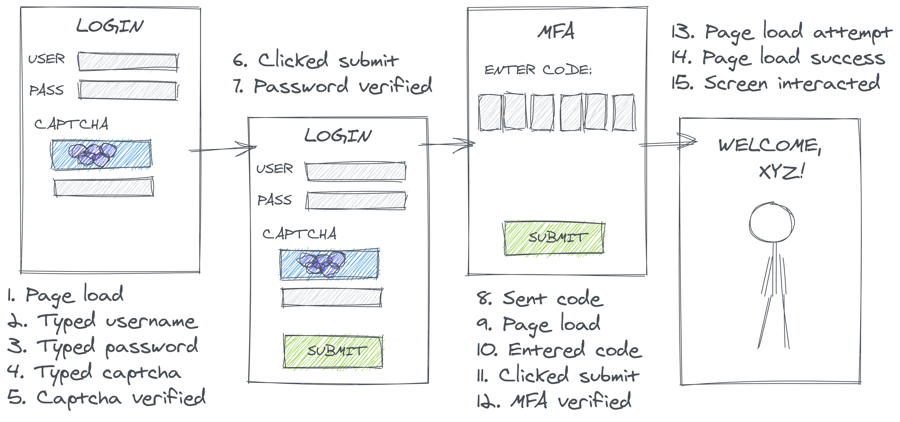
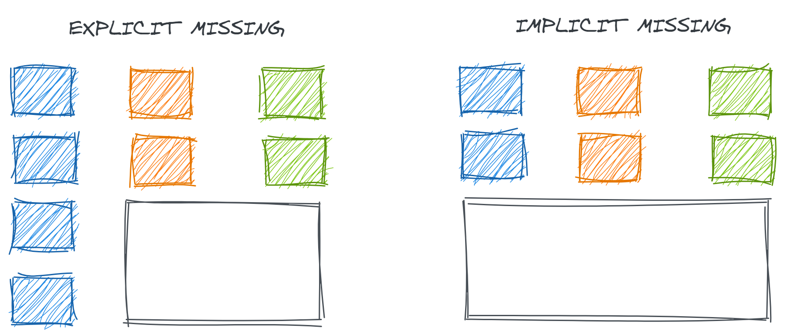
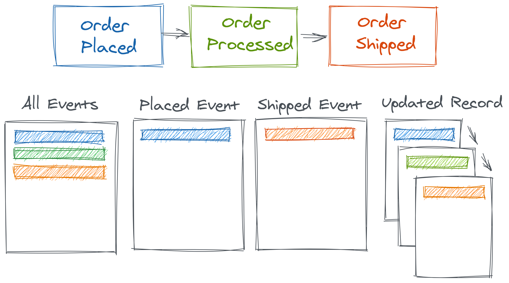
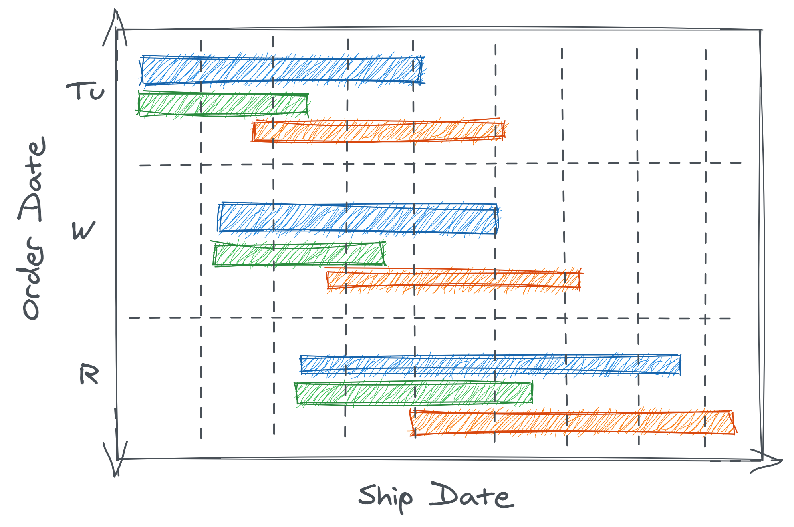
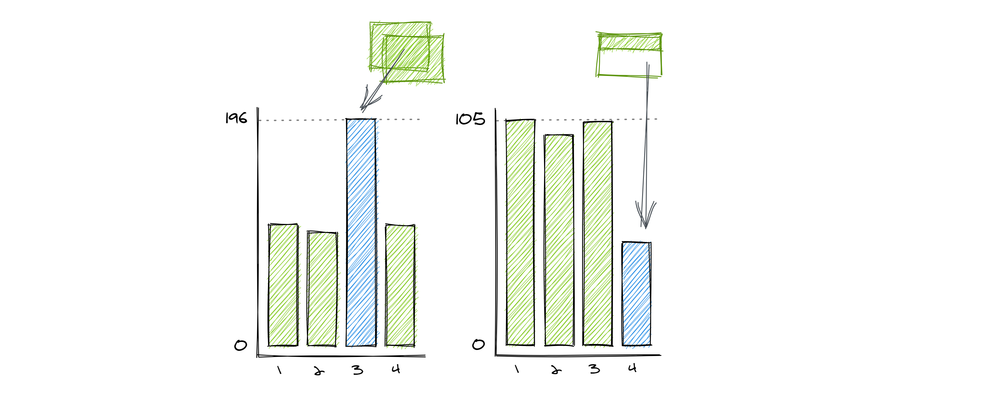
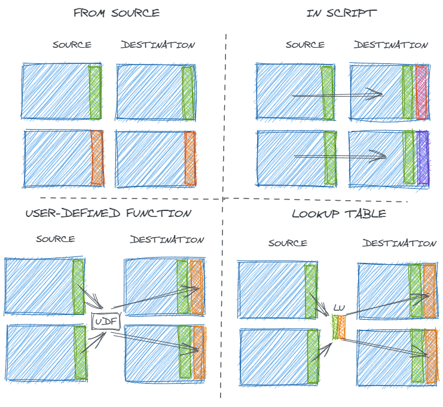
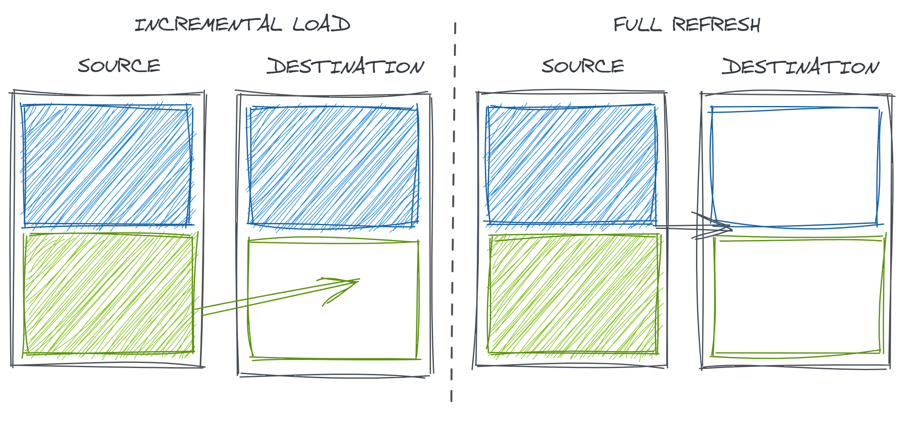
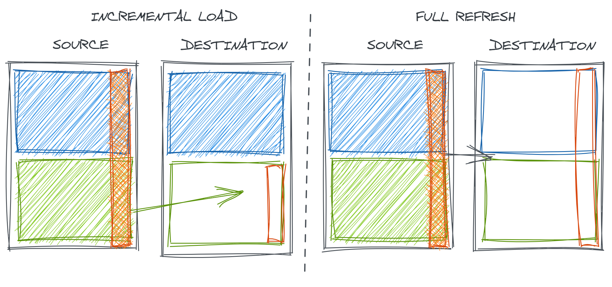

# (PART\*) Data {-} 

# Data Dalliances {#data-dall}

The first step to data analysis is, in fact, data. While this may seem obvious, statistics textbooks often dodge this detail. 
Discussions of regression analysis often begin with a statement like:

> "Let $X$ be the $n x p$ design matrix of independent variables..."

but in practice this statement is as absurd as writing a book about how to win a basketball game, assuming your team already has a 20 point lead with 1 minute left to play.

It's very convenient but typically incorrect to assume that the data we happen to have is the ideal (or, more humbly, sufficient) data for the questions we wish to analyze. 
The specific vagaries of data vary greatly by domain, but a commonality across many fields (such as political science, economics, epidemiology, and market research) is that we are often called to work with *found data* (or, more formally, "observational data") from administrative sources or production systems.
In contrast to artisanally crafted data experimental data (like the carefully controlled agricultural experiments which motivated many early methods developments in statistics), this data was generated neither by us nor for us. 
To quote Angela Bassa, the head of data science at a consumer robotics company: "Data isn't ground truth. Data are artifacts of systems" [@bassa_2017].

The analytical implications of observational versus experimental data are well explored in the field of causal inference (which we will discuss some in Chapters \@ref(incr-infe) and \@ref(cava-caus)). 
However, this distinction has implications far earlier in the data analysis process, as well.
To name a few:

- Records and fields many not represent the entities or measures most conducive to analysis
- Data collection methods may capture a different subset of events or do so at a different frequency than we expected, leading to systemic biases 
- Data movement between systems can insert errors (or, at minimum, challenges to our intuition)
- Data transformations may be fragile or transient, reflecting the primary purpose of the system not our unrelated analytical use 

In this chapter, we will explore data structures and the full data generating process to better understand how different types of data challenges emerge. 
In doing so, we will hone sharper intuition for how our data can deceive us and what to watch out for when beginning an analysis.

## Preliminaries

Before we begin our exploration of data dalliances, we must first establish a baseline understanding of data structure, data production, and data quality.

### Data Structure Basics

Understanding the content and structure of the data you are using is a critical prerequisite to analysis. 
In this book, we focus on tabular, structured data like one might find in an Excel spreadsheet or relational database.^[Other types of data that one might encounter in the wild include free text, JSON, spatial data, and more. However, many of these require either more advanced analysis techniques or structuring that converts them into tabular data, so they are out of the scope of this discussion.] 

In particular, many tools work best with what R developer Hadley Wickham describes as "tidy data" [@wickham_tidy]. Namely:

1. Each variable forms a column
1. Each observation forms a row
1. Each type of observational unit forms a table

This is analogous to how one generally finds data arranged in a database and how statisticians are used to conceptualizing it. 
For example, the design matrix of a linear model consists of one column of data for each independent variable to be included in the model and one row for each observation.^[When data is arrange this way in a matrix $X$, linear regression coefficients can be computed as $\beta = (\mathbf{X}^\intercal\mathbf{X})^{-1}\mathbf{X}^\intercal \mathbf{y}$] 
As Wickham points out, this is also similar to what is called "3rd normal form" in the world of relational database management systems. 

Using this data structure is valuable not only because it is similar to what many modern data tools expect, but also because it provides us a framework to think critically about what defined each observation and each variable in our dataset.

### Data Production Processes

In statistical modeling we discuss the **data generating process**: we can build models that describe the mechanisms that create our observations. 
We can broaden this notion to think about the generating process of each of these steps of data production. 

Regardless of the type of data (experimental, observational, survey, etc.), there are generally four main steps to production: collection, extraction, loading, and transformation.^[You may hear the last three referred to as ELT or ETL]

- **Collect**: The way in which signals from the real world are captured as data. This could include logging (e.g. for web traffic or system monitoring), sensors (e.g. temperature collection), surveys, and more
- **Extract**: The process of removing data from the place in which it was originally captured in preparation of moving it somewhere in which analysis can be done
- **Load**: The process of loading the extracted data to its final destination
- **Transform**: The process of modeling and transforming data so that its structure is useful for analysis and its variables are interpretable

To better theorize about data quality issues, it's useful to think of four DGPs: the real-world DGP, the data collection/extraction DGP^[I don't mean to imply statisticians do not regularly think about the data collection DGP! The rich literature on missing data imputation, censored data in survival analysis, and non-response bias is survey data collection are just a few examples of how carefully statisticians think about how data collection impacts analysis. I chose to break it out here to discuss the more technical aspects of collection], the data loading DGP, and the data transformation DGP.  

```{r echo = FALSE, out.width = '90%', fig.align = 'center', fig.cap = 'A schematic of the data production process'}

```

For example, consider the role of each of these four DGPs for e-commerce data:

- **Real-world DGP**: Supply, demand, marketing, and a range of factors motivate a consumer to visit a website and make a purchase
- **Data collection DGP**: Parts of the website are instrumented to log certain customer actions. This log is then extracted from the different operational system (login platforms, payment platforms, account records) to be used for analysis
- **Data loading DGP**: Data recorded by different systems is moved to a data warehouse for further processing through some sort of manual, scheduled, or orchestrated job. These different systems may make data available at different frequencies.
- **Data transformation DGP**: To arrive at that final data presentation requires creating a [data model](https://en.wikipedia.org/wiki/Data_model) to describe domain-specific attributes with key variables crafted with data transformations

Or, consider the role of each of these four DGPs for subway ridership data^[Like NYC's infamously messy [turnstile data](http://web.mta.info/developers/turnstile.html). I don't claim to know precisely how this dataset is created, but many of the specific challenges it contains are highly relevant.]:

- **Real-world DGP**: Riders are motivated to use public transportation to commute, run errands, or visit friends. Different motivating factors may cause different weekly and annual seasonality 
- **Data collection DGP**: To ride the subway, riders go to a station and enter and exit through turnstiles. The mechanical rotation of the turnstile caused by a rider passing through is recorded
- **Data loading DGP**: Data recorded at each turnstile is collected through a centralized computer system at the station. Once a week, each station uploads a flat file of this data to a data lake owned by the city's Department of Transportation
- **Data transformation DGP**: Turnstiles from different companies may have different data formats. Transformation may include harmonizing disparate sources, coding system-generated codes (e.g. Station XYZ) to semantically meaningful names (e.g. Main Street Station), and publishing a final unified representation across stations and across time

Throughout this chapter, we'll explore how understanding key concepts about each of these DGPs can help guide our intuition on where to look for problems.

### Data Quality Dimension

To guide our discussion of how data production can affect aspects of data quality, we need a guiding definition of data quality. 
This is challenging because data quality is *subjective* and *task-specific*. 
It matters much more if data is "fit for purpose" and operates in a way that is *transparent* to its users moreso than meeting some preordained quality standard.

Regardless, it's useful for our discussion to think about general dimensions of data quality. Here, we will rely on six dimensions of data quality outlined by Data Management Association. 
STheir official definitions are: 

1. **Completeness**: The proportion of stored data against the potential of “100% complete”
1. **Uniqueness**: Nothing will be recorded more than once based upon how that thing is identified. It is the inverse of an assessment of the level of duplication
1. **Timeliness**: The degree to which data represent reality from the required point in time
1. **Validity**: Data are valid if it conforms to the syntax (format, type, range) of its definition
1. **Accuracy**: The degree to which data correctly describes the "real world" object or event
being described.
1. **Consistency**: The absence of difference, when comparing two or more representations of a
thing against a definition

## Data Collection 

One of the tricky nuances of data collection is understanding what precisely is getting captured and logged in the first place. 
No matter how robust the sensors, loggers, or other mechanisms are that record our dataset, that data is still unfit for its purpose so long as the analyst does not fully understand what it represents. 
In the next section, we will see how what data gets collected (and our understanding of it) can alter our notions of data completion and how we must handle it in our computations.

### What Makes a Record (Row)

The first priority when starting to work with a dataset is understanding what a single record (row) represents and what causes it to be generated.

Consider something as simple as a login system where users must enter their credentials, endure a Captcha-like verification process to prove that they are not a robot, and enter a multi-factor authentication code. Figure \@ref(fig:login-log) depicts such a process.

```{r login-log, echo = FALSE, out.width = '90%', fig.align = 'center', fig.cap = 'A diagram illustrating a multi-step process for a user to login to a website or app'}

```

Which of these events gets collected and recorded has a significant impact on subsequent data processing. 
In a technical sense, no inclusion/exclusion decision here is *incorrect*, per say, but if the producers' choices don't match the consumers' understandings, it can lead to misleading results.

For example, an analyst might seek out a `logins` table in order to calculate the rate of successful website logins. 
Reasonably enough, they might compute this rate as the sum of successful events over the total. 
Now, suppose two users attempt to login to their account, and ultimately, one succeeds in accessing their private information and the other doesn't. 
The analyst would probably hope to compute and report a 50% login success rate. However, depending on how the data is represented, they could quite easily compute nearly any value from 0% to 100%. 

Figure \@ref(fig:login-rate) depicts a few different realistic cases:

```{r login-rate, echo = FALSE, out.width = '90%', fig.align = 'center', fig.cap = 'Login events recorded under different data collection paradigms'}
knitr::include_graphics("figures/data-dall/login-rate.png")
```

- **Per Attempt**: If data is logged once per overall login attempt, successful attempts only trigger one event, but a user who forgot their password may try (and fail) to login multiple times. In the case illustrated above, that deflates the successful login rate to **25%**.
- **Per Event**: If the logins table contains a row for every login-related event, each 'success' will trigger a large number of positive events and each 'failure' will trigger a negative event preceded by zero or more positive events. In the case illustrated below, this inflates our successful login rate to **86%**. 
- **Per Conditional**: If the collector decided to only look at downstream events, perhaps to circumvent record duplication, they might decide to create a record only to denote the success or failure of the final step in the login process (MFA). However, login attempts that failed an upstream step would not generate any record for this stage because they've already fallen out of the funnel. In this case, the computed rate could reach **100%**
- **Per Intermediate**: Similarly, if the login was defined specifically as successful password verification, the computed rate could his **100%** even if some users subsequently fail MFA

|  	| Session 	| Attempt 	| Attempt 	| Outcome 	| Intermediate 	|
|-	|-	|-	|-	|-	|-	|
| Success 	| 1 	| 1 	| 6 	| 1 	| 2 	|
| Total 	| 2 	| 4 	| 7 	| 1 	| 2 	|
| Rate 	| 50% 	| **25%** 	| **86%** 	| **100%** 	| **100%** 	|

While humans have a shared intuition of what concepts like a user, session, or login are, the act of collecting data forces us to map that intuition onto an atomic event. 
Any misunderstanding in precisely what that definition is can have massive impact on the perceived data quality; "per event" data will appear heavily duplicated if it is assumed to be "per session" data.

In some cases, this could be obvious to detect. 
If the system outputs fields that are incredibly specific (e.g. with some hyperbole, imagine a `step_in_the_login_process` field with values taking any of the human-readable descriptions of the fifteen processes listed in the image above), but depending how this source is organized (e.g. in contrast to above, if we only have fields like `sourceid` and `processid` with unintuitive alphanumeric encoded values) and defined, it could be nearly impossible to understand the nuances without uncovering quality metadata or talking to a data producer.

### What Doesn't Make a Record (Row)

Along with thinking about what *does* count (or gets logged), it's equally important to understand what systemically does not generate a record. Consider users who have the intent or desire to login (motivated by a real-world DGP) but cannot find the login page, or users who load the login page but never click a button because they know that they've forgotten their password and see no way to request it. 
Often, some of these corner cases may be some of the most critical and informative (e.g. here, demonstrating some major flaws in our UI). 
It's hard to *computationally* validate what data doesn't exist, so *conceptual* data validation is critical.

### Records versus Keys

The preceding discussion on what types of real-world observations will or will not generate records in our resulting dataset is related to but distinct from another important concept from the world of relational databases: **primary keys**. 

**Primary keys** are a minimal subset of variables in a dataset than define a unique record. 
For example, in the previous discussion of customer logins this might consist of **natural keys**^[Keys with semantic meanings that are naturally part of the dataset] such as the combination of a `session_id` and a `timestamp` or **surrogate keys**^[Keys without semantic meaning that exist primarily for the purpose of being keys] such as a global `event_id` that is generated every time the system logs any event. 

Understanding a table's primary keys can be useful for many reasons. 
To name a few reasons, these fields are often useful for linking data from one table to another and for identifying data errors (if the uniqueness of these fields are not upheld). 
They also can be suggestive of the true granularity of the table. 

However, simply knowing a table's primary keys does *not* resolve the issues we discussed in the prior two sections. 
Any of the many different data collection strategies we considered are *unique* by session and timestamp;
however, as we've seen, that is no guarantee that they *must* contain every session and timestamp in the universe of events.

### What Defines a Variable (Column)

Just as critical as understanding what constitutes a record (row) in a dataset is understanding the precise definition of each variable (column). 
Superficially, this task seems easier: after all, each variable has a name which hopefully includes some semantic information. However, quite often this information can provide a false sense of security. 
Just because you identify a variable with a promising sounding name, that does not mean that it is the most relevant data for your analysis.

For example, consider wanting to analyze patterns in customer spend amounts across orders on an e-commerce website. 
You might find a table of orders with a field called `amt_spend`. But what might this mean?

- If the dataset is sourced from a payment processor, it likely includes the total amount billed to a customers' credit card: including item prices less any discounts, shipping costs, taxes, etc. Alternatively, if this order was split across a gift card and a credit card, this field might only reflect the amount charged to the credit card
- If the dataset is created for Finance, it might perhaps include only the total of item prices less discounts if this best corresponded to the data the Finance team needs for revenue reporting 
- Someone, somewhere, at some point might have assigned `amt_spend` to the name of the variable containing gross spend (before accounting for any discounts) and there might be a different variable `amt_spend_net` which accounts for discounts applied

It's critical to understand what each variable *actually* means. 
The upside of this is that it forces analysts to think more crisply about their research questions and what the *ideal* variables for their analysis would be. 
As we've seen, concepts like "spend" may seem deceptively simple, but are not unambiguous.

### The Many Meanings of Null

Related to the presence and absence of full *records* is the presence or absence of individual *fields*. 
If records contain some but not all relevant information, they may be published with explicitly missing fields or the full record may not be published at all. The difference between implicit and explicit missingness on the resulting data is illustrated in Figure \@ref(fig:null-impl-expl).

```{r null-impl-expl, echo = FALSE, out.width = '90%', fig.align = 'center', fig.cap = "A comparison of explicit versus implicit missingness"}

```

Understanding what the system implies by each *explicitly* missing data field is also critical for validation and analysis. 
Checks for data completeness usually include counting null values, but null data isn't always incorrect. 
In fact, null data can be highly informative if we know what it means. Some meanings of null data might include:

- **Field is not relevant**: Perhaps our `logins` table reports the mobile phone operating system (iOS or Android) that was used to access the login page to track platform-specific issues. However, there is no valid value for this 
- **Relevant value is not known**: Our `logins` table might also have an `account_id` field which attempts to match login attempts to known accounts/customers using different metadata like cookies or IP addresses. In theory, almost everyone trying to log in should have an account identifier, but our methods may not be good enough to identify them in all cases
- **Relevant value is null**: Of course, sometimes someone without an account at all might try to log in for some reason. In this case, the correct value for an `account_id` field truly *is* null
- **Relevant value was recorded incorrectly**: Sometimes systems have glitches. Without a doubt, every single login attempt *should* have a timestamp, but such a field could be null if this data was somehow lost or corrupted at the source

Similarly, different systems might or might not report out these nulls in different ways such as:

- **True nulls**: Literally the entry in the resulting dataset is null
- **Null-like non-nulls**: Blank values like an empty string (`''`) that contain a null amount of information but won't be detected when counting null values
- **Placeholder values**: Meaningless values like an `account_id` of `00000000` for all unidentified accounts which preserve data *validity* (the expected structure) but have no intrinsic meaning
- **Sentinel/shadow values**: Abnormal values which attempt to indicate the reasons for null-ness such as an `account_id` of `-1` when no browser cookies were found or `-2` when cookies were found but did not help link to any specific customer record

Each of these encoding choices changes the definitions of appropriate completeness and validity for each field and, even more critically, impacts the expectations and assertions we should form for data accuracy. 
We can't expect 100% completeness if nulls are a relevant value; we can't check validity of ranges as easily if sentinel values are used with values that are outside the normal range (hopefully, or we have much bigger problems!) 
So, understanding how upstream systems *should* work is essential for assessing if they *do* work.

Similarly, understanding how our null data is collected has significant implications for how we subsequently process it. We will discuss this more in Chapter \@ref(comp-quan) (Computational Quandaries).

## Data Extraction & Loading

Checking that data contains expected and *only* expected records (that is, completeness, uniqueness, and timeliness) is one of the most common first steps in data validation. 
However, the superficially simple act of loading data into a data warehouse or updating data between tables can introduce a variety of risks to data completeness which require different strategies to detect. 
Data loading errors can result in data that is stale, missing, duplicate, inconsistently up-to-date across sources, or complete but for only a subset of the range you think.

While the data quality principles of **completeness**, **uniqueness**, and **timeliness** would suggest that records should exist once and only once, the reality of many haphazard data loading process means data may appear sometime between zero and a handful of times. Data loads can occur in many different ways. 
For example, they might be:

- manually executed
- scheduled (like a [cron](https://en.wikipedia.org/wiki/Cron) job)
- orchestrated (with a tool like [Airflow](https://airflow.apache.org/) or [Prefect](https://www.prefect.io/))

No approach is free from challenges. 
For example, scheduled jobs risk executing before an upstream process has completed (resulting in stale or missing data); 
poorly orchestrated jobs may be prevented from working due to one missing dependency or might allow multiple stream to get out of sync (resulting in multisource missing data). 
Regardless of the method, all approaches must be carefully configured to handle failures gracefully to avoid creating duplicates, and the frequency at which they are executed may cause partial loading issues if it is incompatible with the granularity of the source data.

#### Data Load Failure Modes

To develop our understanding of the true data generating process and to formulate theories on how our data could be broken (and what we should validate), it is useful to understand the different ways data extraction and loading can fail. 

Figure \@ref(fig:data-load) illustrates a number of examples. Suppose that each row of boxes in the diagram represents one day of records in a table.

```{r data-load, echo = FALSE, out.width = '90%', fig.align = 'center', fig.cap = "Different modes of data loading failure"}
knitr::include_graphics("figures/data-dall/data-load.png")
```

Our dataset might be susceptible to:

- **Stale data** occurs when the data is not as up-to-date as would be expected from is regular refresh cadence. This could happen if a manual step was skipped, a scheduled job was executed before the upstream source was available, or orchestrated data checks found errors and quarantined new records
- **Missing data** occurs when one data load fails but subsequent loads have succeeded
- **Duplicate data** occurs when one data load is executed multiple times
- **Multisource missing data** occurs when a table is loaded from multiple sources, and some have continued to update as expected while others have not
- **Partial data** occurs when a table is loaded correctly as intended by the producer but contains less data than expected by the consumer (e.g. a table loads ever 12 hours but because there is some data for a given date, the user assumes that all relevant records for that date have been loaded)

The differences in these failure modes become important when an analyst attempts to assess data completeness.
One of the first approaches an analyst might consider is simply to check the `min()` and `max()` event dates in their table. 
However, this can only help detect stale data. 
To catch missing data, an analyst might instead attempt to count the number of `distinct` days represented in the data; to detect duplicate data, that analyst might need to count records by day and examine the pattern. 

| Metric 	| Stale 	| Missing 	| Duplicate 	| Multi 	| Partial 	|
|-	|-	|-	|-	|-	|-	|
| `min(date)`<br> `max(date)` 	| **1<br>3** 	| 1<br>4 	| 1<br>4 	| 1<br>4 	| 1<br>4 	|
| `count(distinct date)` 	| **3** 	| **3** 	| 4 	| 4 	| 4 	|
| `count(1) by date` 	| **100<br>100<br>100<br>0** 	| **100<br>100<br>0<br>100** 	| **100<br>100<br>200<br>100** 	| 100<br>100<br>66<br>66 	| 100<br>100<br>100<br>50 	|
| `count(1)`<br> `count(distinct PKs)` 	| 300<br>300 	| 300<br>300 	| **400<br>300** 	| 332<br>332 	| 350<br>350 	|

In a case like the toy example above where the correct number of rows per date is highly predictable and the number of dates is small, such eyeballing is feasible; 
however when the expected number of records varies day-to-day or time series are long, this approach becomes subjective, error-prone, and intractable. 
Additionally, it still might be hard to catch errors in mutli-source data or partial loads if the lower number of records was still within the bounds of reasonable deviation for a series. 
These last two types deserve further exploration.

#### Multi-Source

A more effective strategy for assessing data completeness requires a better understanding of how data is being collected and loaded. 
In the case of multi-source data, one single source stopping loading may not be a big enough change to disrupt aggregate counts but could still jeopardize meaningful analysis. 
It would be more useful to conduct completeness checks by *subgroup* to identify these discrepancies.

But not any subgroup will do; 
the subgroup must correspond to the various data sources. 
For example, suppose we run an e-commerce store and wish to look at sales from the past month by category.
Naturally, we might think to check the completeness of the data by category. 
But what if sales data is sourced from three separate locations: our Shopify site (80%), our Amazon Storefront (15%), and phone sales (5%).
Unless we explicitly check completeness by channel (a dimension we don't particularly care about for our analysis), it would be easy to miss if our data source for phone sales has stopped working or loads at a different frequency.

Another interesting aspect of multi-source data, is multiple sources can contribute either to different *rows/records* or different *columns/variables*. 
Table-level frequency counts won't help us in the latter case since other sources might create the right total number of records but result in some specific fields in those records being missing or inaccurate.

#### Partial Loads

Partial loads really are not data errors at all, but are still important to detect since they can jeopardize an analysis. 
A common scenario might occur if a job loads new data every 12 hours (say, data from the morning and afternoon of day n-1 loads on day n at 12AM and 12PM, respectively). 
An analyst retrieving data at 11AM may be concerned to see an approximate ~50% drop in sales in the past day, despite confirming that their data looks to be "complete" since the maximum record date is, in fact, day n-1.
Of course, this concern could be somewhat easily allayed if they then checked a timestamp field, but such a field might not exists or might not have been used for validation since its harder to anticipate the appropriate maximum timestamp than it is the maximum date.

#### Delayed or Transient Records

The interaction between choices made in the data collection and data loading phases can introduce their own sets of problems.

Consider an `orders` table for an e-commerce company that analysts may use to track customer orders. 
It might contain one record per `order_id` x `event` (placement, processing, shipment), one record per order placed, one record per order shipping, or one record per order with a `status` field that changes over time to denote the order's current stage of life. Some of these options are illustrated in Figure \@ref(fig:order-log).

```{r order-log, echo = FALSE, out.width = '90%', fig.align = 'center', fig.cap= "Illustration of alternative data collection and extraction strategies for order data"}

```

Any of these modeling choices seem reasonable and the difference between them might appear immaterial. 
But consider the *collection* choice to record and report *shipped* events. 
Perhaps this might be operationally easier if shipment come from one source system whereas orders could come from many. 
However, an interesting thing about shipments is that they are often lagged in a variable way from the order date.

Suppose the e-commerce company in question offers three shipping speeds at checkout. Figure \@ref(fig:order-date) shows the range of possible shipment dates based on the order dates for the three different speeds (shown in different bars/colors). 

```{r order-date, echo = FALSE, out.width = '90%', fig.align = 'center', fig.cap = 'A conceptual chart of when different classes of real-world events might materialize as records in our dataset'}

```

How might this effect our perceived data quality?

- Order data could appear **stale** or not timely since orders with a given `order_date` would only load days later once shipped
- Similar to **missing** or **multisource** data, the data *range* in the table could lead to deceptive and incomplete data validation because some orders from a later order date might ship (and thus be logged) before all orders from a previous order date
- Put another way, we could have multiple order dates demonstrating **partial** data loads
- These features of the data might behave inconsistently across time due to seasonality (e.g. no shipping on weekends or federal holidays), so heuristics developed to clean the data based on a small number of observations could fail
- From an analytical perspective, orders with faster shipping would be disproportionately overrepresented in the "tail" (most recent) data. If shipping category correlated with other characteristics like total order spend, this could create an artificial trend in the data

Once again, understanding that data is *collected* at point of shipment and reasoning how shipment timing varies and impacts *loading* is necessary for successful validation.

If this thought experiment seems to vague, we can make it more concrete by mocking up a dataset with which to experiment. 

In the simplest version, we will simply suppose one order is submited on each of 10 days with dates (represented for convenience as integers and not calendar dates) given by the `dt_subm` vector. 
Suppose shipping always takes three days, so we can easily calculate the shipment date (`dt_ship`) based on the submission date. 
The shipment date is the same as the date the data will be logged and loaded (`dt_load`).

```{r}
# data simulation: single orders + deterministic ship dates ----
dt_subm <- 1:10
days_to_ship <- 3
dt_ship <- dt_subm + days_to_ship
dt_load <- dt_ship
df <- data.frame(dt_subm, dt_ship, dt_load)
head(df)
```

Suppose we are an analyst living in day 5 and wonder how many orders were submitted on day 3. 
We can observe all shipments loaded before day 5 so we filter our data accordingly.
However, when we count how many records exist for day 3 we find none.
Instead, when we move ahead to an analysis date of day 7, we are able to observe the orders submitted on day 3.

```{r error = FALSE, warning = FALSE, message = FALSE}
library(dplyr)

# how many day-3 orders do we observe as of day-5? ----
df %>% 
  filter(dt_load <= 5) %>% 
  filter(dt_subm == 3) %>% 
  nrow()

# how many day-3 orders do we observe as of day-7? ----
df %>% 
  filter(dt_load <= 7) %>% 
  filter(dt_subm == 3) %>% 
  nrow()
```

(Note that these conditions could be checked much more succinctly with a base R expression such as `sum(df$dt_load < 7 & df$dt_subm == 3)`.
However, there is sometimes virtue in option for more readable code even if it is less compact. 
Here, we prefer the more verbose option for the claritfy of our exposition.
Such trade-offs, and general thoughts on coding style, are explored further in Chapter \@ref(comp-code).)

Now, this may seem to trivial. Clearly, if there were *zero* records for a day, we would catch this in data validation, right?
We can make our synthetic data slightly more realistic to better illustrate the problem. 
Let's not imagine that there are 10 orders each day, and each order is shipped sometime between 2 and 4 days after the order with equal probability. 

```{r}
# data simulation: multiple orders + random ship dates ----
dt_subm <- rep(x = 1:10, each = 10)
days_to_ship <- sample(x = 2:4, size = length(dt_subm), replace = TRUE)
dt_ship <- dt_subm + days_to_ship
dt_load <- dt_ship
df <- data.frame(dt_subm, dt_ship, dt_load)
head(df)
```

When we repeat the prior analysis, we now see that we have *some* records for orders submitted on day 3 by the time we begin analysis on day 5.
In this case, we might be more easily tricked to believe this is *all* orders.
However, when we repeat the analysis on day 7, we see the the number of orders on day 3 has increased.

```{r include = FALSE}
# how many day-3 orders do we observe as of day-5? ----
df %>% 
  filter(dt_load <= 5) %>% 
  filter(dt_subm == 3) %>% 
  nrow()

# how many day-3 orders do we observe as of day-7? ----
df %>% 
  filter(dt_load <= 7) %>% 
  filter(dt_subm == 3) %>% 
  nrow()
```

Of course, you can imagine the real world is yet much more complicated than this example.
In reality, we would have a random number of orders each day.
Additionally, we might have a *mixture* of different *types* of orders.
There might be high-priced orders where customers tended to be willing to pay for faster shipping,
and low-priced orders where customers tend to chose slower shipping.
In a case like this, not only might naive validation miss the lack of data completeness, but the *sample* of shipments we begin to see on day 5 could be unrepresentative of the population of orders placed on day 3. 
This is a type of **selection bias** that we will examine further in Chapter \@ref(incr-infe) (Incredible Inferences).

## Data Encoding, Modeling, & Transformation (TODO)

## Strategies (TODO)


<!--
## Strategies 

Developing a deep and accurate understanding of the available data -- especially its biases, blindspots, and beguilements -- is critical to analyzing it credibly. To do this, it is helpful to conceptualize the complete **data generating process** including the *real world* process which the data captures, how those real-world symbols are *collected* into digital form, how and when that captured data is *loaded* across systems, and finally how it is *transformed* before its final presentation to us as analysts.

```{r echo = FALSE, out.width = '90%', fig.align = 'center'}

```

For example, consider the role of each of these four DGPs for subway ridership data^[Like NYC's infamously messy [turnstile data](http://web.mta.info/developers/turnstile.html). I don't claim to know precisely how this dataset is created, but many of the specific challenges it contains are highly relevant.]:

- **Real-world DGP**: Riders are motivated to use public transportation to commute, run errands, or visit friends. Different motivating factors may cause different weekly and annual seasonality 
- **Data collection DGP**: To ride the subway, riders go to a station and enter and exit through turnstiles. The mechanical rotation of the turnstile caused by a rider passing through is recorded
- **Data loading DGP**: Data recorded at each turnstile is collected through a centralized computer system at the station. Once a week, each station uploads a flat file of this data to a data lake owned by the city's Department of Transportation
- **Data transformation DGP**: Turnstiles from different companies may have different data formats. Transformation may include harmonizing disparate sources, coding system-generated codes (e.g. Station XYZ) to semantically meaningful names (e.g. Main Street Station), and publishing a final unified representation across stations and across time

This chapter examines some of the specific vagaries that arise from this process for system-generated and human-inputted data. We will explore how each step of the full data generating process can cause unexpected behaviors for data analysts and how such patterns can be better identified and corrected. 

## Foundational Concepts

### Defining Data Quality

### Steps of Data Production


Unfortunately, consumers of analytical data may not always be familiar with the craft of data production (including data engineering, data modeling, and data management). Without an understanding of the general flow of data processing between collection and publication to a data warehouse, data consumers are less able to theorize about failure modes. Instead, similarly to blindly fitting models without an underlying theory, consumers may default to cursory checks of summary statistics without hypotheses for the kind of errors they are trying to detect or how these checks might help them.

This post explores the DGP of system-generated data and the common ways that these processes can introduce risks to data quality. As we discuss data validation, we will make reference to the six dimensions of data quality defined by [DAMA](https://damauk.wildapricot.org/resources/Documents/DAMA%20UK%20DQ%20Dimensions%20White%20Paper2020.pdf): completeness, uniqueness, timeliness, validity, accuracy, and consistency. Along the way, we will explore how understanding how understanding key failure modes in the data production process can lead to more principled analytical data validation.^[Of course, strategies for collection, moving, transforming, storing, and validating data are innumerable. This is not intended to be a comprehensive guide on any of these topics but simply to illustrate why its important for analysts to keep in mind the *interplay* between these steps.]

## The Four DGPs for Data Management

To better theorize about data quality issues, it's useful to think of four DGPs: the real-world DGP, the data collection/extraction DGP^[I don't mean to imply statisticians do not regularly think about the data collection DGP! The rich literatures on missing data imputation, censored data in survival analysis, and non-response bias is survey data collection are just a few examples of how carefully statisticians think about how data collection impacts analysis. I chose to break it out here to discuss the more technical aspects of collection], the data loading DGP, and the data transformation DGP.  

```{r echo = FALSE, out.width = '90%', fig.align = 'center'}

```

For example, consider the role of each of these four DGPs for e-commerce data:

- **Real-world DGP**: Supply, demand, marketing, and a range of factors motivate a consumer to visit a website and make a purchase
- **Data collection DGP**: Parts of the website are instrumented to log certain customer actions. This log is then extracted from the different operational system (login platforms, payment platforms, account records) to be used for analysis
- **Data loading DGP**: Data recorded by different systems is moved to a data warehouse for further processing through some sort of manual, scheduled, or orchestrated job. These different systems may make data available at different frequencies.
- **Data transformation DGP**: To arrive at that final data presentation requires creating a [data model](https://en.wikipedia.org/wiki/Data_model) to describe domain-specific attributes with key variables crafted with data transformations

Or, consider the role of each of these four DGPs for subway ridership data^[Like NYC's infamously messy [turnstile data](http://web.mta.info/developers/turnstile.html). I don't claim to know precisely how this dataset is created, but many of the specific challenges it contains are highly relevant.]:

- **Real-world DGP**: Riders are motivated to use public transportation to commute, run errands, or visit friends. Different motivating factors may cause different weekly and annual seasonality 
- **Data collection DGP**: To ride the subway, riders go to a station and enter and exit through turnstiles. The mechanical rotation of the turnstile caused by a rider passing through is recorded
- **Data loading DGP**: Data recorded at each turnstile is collected through a centralized computer system at the station. Once a week, each station uploads a flat file of this data to a data lake owned by the city's Department of Transportation
- **Data transformation DGP**: Turnstiles from different companies may have different data formats. Transformation may include harmonizing disparate sources, coding system-generated codes (e.g. Station XYZ) to semantically meaningful names (e.g. Main Street Station), and publishing a final unified representation across stations and across time

In the next sections, we'll explore how understanding key concepts about each of these DGPs can help build a consumers' intuition on where to look for problems.

## System-Generated Data

### Data Collection

Data collection is necessarily the first step in data production, but the very goal of data collection: translating complex human concepts into tabular data records is fraught with error. Data collection is effectively dimensionality reduction, and just like statistical dimensionality reduction, it must sometimes sacrifice accuracy for clarity. 

This tradeoff makes data collection vulnerable to one of the largest risks to data validity: not that the data itself is incorrect *given its stated purpose* but rather that users misconstrue the population or metrics it includes. Thus, understanding what systems are intending to capture, publish, and extract and how they chose to encode information for those observations is essential for data validation and subsequent analysis. 

Data collection can happen in countless different ways: experimentation, surveys, observation, sensors, etc. In many business settings, data is often extracted from source systems whose primary purpose is to execute some sort of real-world process.^[As Angela Bass so aptly [writes](https://medium.com/@angebassa/data-alone-isnt-ground-truth-9e733079dfd4): "Data isn't ground truth. Data are artifacts of systems."] Such systems may naturally collect data for operational purposes or may be *instrumented* to collect and log data as they are used. This production data is then often extracted from a source system to an alternative location such as a data warehouse for analysis.

#### What Counts

One of the tricky nuances of data collection is understanding what precisely is getting captured and logged in the first place. 

Consider something as simple as a login system where users must enter their credentials, endure a Captcha-like verification process to prove that they are not a robot, and enter a multi-factor authentication code.

```{r echo = FALSE, out.width = '90%', fig.align = 'center'}

```

Which of these events gets collected and recorded has a significant impact on subsequent data processing. In a technical sense, no inclusion/exclusion decision here is *incorrect*, persay, but if the producers' choices don't match the consumers' understandings, it can lead to misleading results.

For example, an analyst might seek out a `logins` table in order to calculate the rate of successful website logins. Reasonably enough, they might compute this rate as the sum of successful events over the total. Now, suppose two users attempt to login to their account, and ultimately, one succeeds in accessing their private information and the other doesn't. The analyst would probably hope to compute and report a 50% login success rate. However, depending on how the data is represented, they could quite easily compute nearly any value from 0% to 100%.

```{r echo = FALSE, out.width = '90%', fig.align = 'center'}
knitr::include_graphics("figures/data-dall/login-rate.png")
```

- **Per Attempt**: If data is logged once per overall login attempt, successful attempts only trigger one event, but a user who forgot their password may try (and fail) to login multiple times. In the case illustrated above, that deflates the successful login rate to **25%**.
- **Per Event**: If the logins table contains a row for every login-related event, each 'success' will trigger a large number of positive events and each 'failure' will trigger a negative event preceded by zero or more positive events. In the case illustrated below, this inflates our successful login rate to **86%**. 
- **Per Conditional**: If the collector decided to only look at downstream events, perhaps to circumvent record duplication, they might decide to create a record only to denote the success or failure of the final step in the login process (MFA). However, login attempts that failed an upstream step would not generate any record for this stage because they've already fallen out of the funnel. In this case, the computed rate could reach **100%**
- **Per Intermediate**: Similarly, if the login was defined specifically as successful password verification, the computed rate could his **100%** even if some users subsequently fail MFA

|  	| Session 	| Attempt 	| Attempt 	| Outcome 	| Intermediate 	|
|-	|-	|-	|-	|-	|-	|
| Success 	| 1 	| 1 	| 6 	| 1 	| 2 	|
| Total 	| 2 	| 4 	| 7 	| 1 	| 2 	|
| Rate 	| 50% 	| **25%** 	| **86%** 	| **100%** 	| **100%** 	|

While humans have a shared intuition of what concepts like a user, session, or login are, the act of collecting data forces us to map that intuition onto an atomic event . Any misunderstanding in precisely what that definition is can have massive impact on the perceived data quality; "per event" data will appear heavily duplicated if it is assumed to be "per session" data.

In some cases, this could be obvious to detect. If the system outputs fields that are incredibly specific (e.g. with some hyperbole, imagine a `step_in_the_login_process` field with values taking any of the human-readable descriptions of the fifteen processes listed in the image above), but depending how this source is organized (e.g. in contrast to above, if we only have fields like `sourceid` and `processid` with unintuitive alphanumeric encoded values) and defined, it could be nearly impossible to understand the nuances without uncovering quality metadata or talking to a data producer.^[Of course, this isn't the only potential type of issue in data collection. While *instrumentation* often leads to these definitional challenges, other types of data collection like *sensors* can have other types of challenges like systematically failing to capture certain observations. Consider, for example, bus ridership data collected as riders scan their pass upon entering. If students can ride free by showing the driver their student ID, these observations may be systemically not recorded. Again, relying on an *operational* system could lead *analytics* uses astray (like failing to account for peak usage times for this demographic.)]

#### What Doesn't Count

Along with thinking about what *does* count (or gets logged), it's equally important to understand what systemically does not generate a record. Consider users who have the intent or desire to login (motivated by a real-world DGP) but cannot find the login page, or users who load the login page but never click a button because they know that they've forgotten their password and see no way to request it. Often, some of these corner cases may be some of the most critical and informative (e.g. here, demonstrating some major flaws in our UI). It's hard to *computationally* validate what data doesn't exist, so *conceptual* data validation is critical.

#### The Many Meanings of Null

Related to the presence and absence of full *records* is the presence or absence of individual *fields*. If records contain some but not all relevant information, they may be published with explicitly missing fields or the full record may not be published at all.

```{r echo = FALSE, out.width = '90%', fig.align = 'center'}

```

Understanding what the system implies by each *explicitly* missing data field is also critical for validation and analysis. Checks for data completeness usually include counting null values, but null data isn't always incorrect. In fact, null data can be highly informative if we know what it means. Some meanings of null data might include:

- **Field is not relevant**: Perhaps our `logins` table reports the mobile phone operating system (iOS or Android) that was used to access the login page to track platform-specific issues. However, there is no valid value for this 
- **Relevant value is not known**: Our `logins` table might also have an `account_id` field which attempts to match login attempts to known accounts/customers using different metadata like cookies or IP addresses. In theory, almost everyone trying to log in should have an account identifier, but our methods may not be good enough to identify them in all cases
- **Relevant value is null**: Of course, sometimes someone without an account at all might try to log in for some reason. In this case, the correct value for an `account_id` field truly *is* null
- **Relevant value was recorded incorrectly**: Sometimes systems have glitches. Without a doubt, every single login attempt *should* have a timestamp, but such a field could be null if this data was somehow lost or corrupted at the source

Similarly, different systems might or might not report out these nulls in different ways such as:

- **True nulls**: Literally the entry in the resulting dataset is null
- **Null-like non-nulls**: Blank values like an empty string (`''`) that contain a null amount of information but won't be detected when counting null values
- **Placeholder values**: Meaningless values like an `account_id` of `00000000` for all unidentified accounts which preserve data *validity* (the expected structure) but have no intrinsic meaning
- **Sentinel/shadow values**: Abnormal values which attempt to indicate the reasons for null-ness such as an `account_id` of `-1` when no browser cookies were found or `-2` when cookies were found but did not help link to any specific customer record

Each of these encoding choices changes the definitions of appropriate completeness and validity for each field and, even more critically, impacts the expectations and assertions we should form for data accuracy. We can't expect 100% completeness if nulls are a relevant value; we can't check validity of ranges as easily if sentinel values are used with values that are outside the normal range (hopefully, or we have much bigger problems!) So, understanding how upstream systems *should* work is essential for assessing if they *do* work.

### Data Loading

Checking that data contains expected and *only* expected records (that is, completeness, uniqueness, and timeliness) is one of the most common first steps in data validation. However, the superficially simple act of loading data into a data warehouse or updating data between tables can introduce a variety of risks to data completeness which require different strategies to detect. Data loading errors can result in data that is stale, missing, duplicate, inconsistently up-to-date across sources, or complete but for only a subset of the range you think.

While the data quality principles of **completeness**, **uniqueness**, and **timeliness** would suggest that records should exist once and only once, the reality of many haphazard data loading process means data may appear sometime between zero and a handful of times. Data loads can occur in many different ways. For example, they might be:

- manually executed
- scheduled (like a [cron](https://en.wikipedia.org/wiki/Cron) job)
- orchestrated (with a tool like [Airflow](https://airflow.apache.org/) or [Prefect](https://www.prefect.io/))

No approach is free from challenges. For example, scheduled jobs risk executing before an upstream process has completed (resulting in stale or missing data); poorly orchestrated jobs may be prevented from working due to one missing dependency or might allow multiple stream to get out of sync (resulting in multisource missing data). Regardless of the method, all approaches must be carefully configured to handle failures gracefully to avoid creating duplicates, and the frequency at which they are executed may cause partial loading issues if it is incompatible with the granularity of the source data.

#### Data Load Failure Modes

For example, suppose in the diagram below that each row of boxes represents one day of records in a table.

```{r echo = FALSE, out.width = '90%', fig.align = 'center'}
knitr::include_graphics("figures/data-dall/data-load.png")
```

- **Stale data** occurs when the data is not as up-to-date as would be expected from is regular refresh cadence. This could happen if a manual step was skipped, a scheduled job was executed before the upstream source was available, or orchestrated data checks found errors and quarantined new records
- **Missing data** occurs when one data load fails but subsequent loads have succeeded
- **Duplicate data** occurs when one data load is executed multiple times
- **Multisource missing data** occurs when a table is loaded from multiple sources, and some have continued to update as expected while others have not
- **Partial data** occurs when a table is loaded correctly as intended by the producer but contains less data than expected by the consumer (e.g. a table loads ever 12 hours but because there is some data for a given date, the user assumes that all relevant records for that date have been loaded)

The differences in these failure modes become important when an analyst attempts to assess data completeness. One of the first approaches an analyst might consider is simply to check the `min()` and `max()` event dates in their table. However, this can only help detect stale data. To catch missing data, an analyst might instead attempt to count the number of `distinct` days represented in the data; to detect duplicate data, that analyst might need to count records by day and examine the pattern. 

| Metric 	| Stale 	| Missing 	| Duplicate 	| Multi 	| Partial 	|
|-	|-	|-	|-	|-	|-	|
| `min(date)`<br> `max(date)` 	| **1<br>3** 	| 1<br>4 	| 1<br>4 	| 1<br>4 	| 1<br>4 	|
| `count(distinct date)` 	| **3** 	| **3** 	| 4 	| 4 	| 4 	|
| `count(1) by date` 	| **100<br>100<br>100<br>0** 	| **100<br>100<br>0<br>100** 	| **100<br>100<br>200<br>100** 	| 100<br>100<br>66<br>66 	| 100<br>100<br>100<br>50 	|
| `count(1)`<br> `count(distinct PKs)` 	| 300<br>300 	| 300<br>300 	| **400<br>300** 	| 332<br>332 	| 350<br>350 	|

In a case like the toy example above where the correct number of rows per date is highly predictable and the number of dates is small, such eyeballing is feasible; however when the expected number of records varies day-to-day or time series are long, this approach becomes subjective, error-prone, and intractable. Additionally, it still might be hard to catch errors in mutli-source data or partial loads if the lower number of records was still within the bounds of reasonable deviation for a series. These last two types deserve further exploration.

#### Multi-Source

A more effective strategy for assessing data completeness requires a better understanding of how data is being collected and loaded. In the case of multi-source data, one single source stopping loading may not be a big enough change to disrupt aggregate counts but could still jeopardize meaningful analysis. It would be more useful to conduct completeness checks by *subgroup* to identify these discrepancies.

But not any subgroup will do; the subgroup must correspond to the various data sources. For example, suppose we run an e-commerce store and wish to look at sales from the past month by category. Naturally, we might think to check the completeness of the data by category. But what if sales data is sourced from three separate locations: our Shopify site (80%), our Amazon Storefront (15%), and phone sales (5%). Unless we explicitly check completeness by channel (a dimension we don't particularly care about for our analysis), it would be easy to miss if our data source for phone sales has stopped working or loads at a different frequency.

Another interesting aspect of multi-source data, is multiple sources can contribute either to different *rows/records* or different *columns/variables*. Table-level frequency counts won't help us in the latter case since other sources might create the right total number of records but result in some specific fields in those records being missing or inaccurate.

#### Partial Loads

Partial loads really are not data errors at all, but are still important to detect since they can jeopardize an analysis. A common scenario might occur if a job loads new data every 12 hours (say, data from the morning and afternoon of day n-1 loads on day n at 12AM and 12PM, respectively). An analyst retrieving data at 11AM may be concerned to see an approximate ~50% drop in sales in the past day, despite confirming that their data looks to be "complete" since the maximum record date is, in fact, day n-1.^[Of course, this concern could be somewhat easily allayed if they then checked a timestamp field, but such a field might not exists or might not have been used for validation since its harder to anticipate the appropriate maximum timestamp than it is the maximum date.]

#### Delayed or Transient Records

The interaction between choices made in the data collection and data loading phases can introduce their own sets of problems.

Consider an `orders` table for an e-commerce company that analysts may use to track customer orders. It might contain one record per `order_id` x `event` (placement, processing, shipment), one record per order placed, one record per order shipping, or one record per order with a `status` field that changes over time to denote the order's current stage of life.

```{r echo = FALSE, out.width = '90%', fig.align = 'center'}

```

Any of these modeling choices seem reasonable and the difference between them might appear immaterial. But consider the *collection* choice to record and report *shipped* events. Perhaps this might be operationally easier if shipment come from one source system whereas orders could come from many. However, an interesting thing about shipments is that they are often lagged in a variable way from the order date.

```{r echo = FALSE, out.width = '90%', fig.align = 'center'}

```

Suppose the e-commerce company in question offers three shipping speeds at checkout. The chart below shows the range of possible shipment dates based on the order dates for the three different speeds (shown in different bars/colors). How might this effect our perceived data quality?

- Order data could appear **stale** or not timely since orders with a given `order_date` would only load days later once shipped
- Similar to **missing** or **multisource** data, the data *range* in the table could lead to deceptive and incomplete data validation because some orders from a later order date might ship (and thus be logged) before all orders from a previous order date
- Put another way, we could have multiple order dates demonstrating **partial** data loads
- These features of the data might behave inconsistently across time due to seasonality (e.g. no shipping on weekends or federal holidays), so heuristics developed to clean the data based on a small number of observations could fail
- From an analytical perspective, orders with faster shipping would be disproportionately overrepresented in the "tail" (most recent) data. If shipping category correlated with other characteristics like total order spend, this could create an artificial trend in the data

Once again, understanding that data is *collected* at point of shipment and reasoning how shipment timing varies and impacts *loading* is necessary for successful validation.

```{r}
library(dplyr)
library(ggplot2)

# simulate data ----
dt_order <- rep(1:5, each = 5)
dt_ship <- dt_order + sample(1:3, length(dt_order), replace = TRUE)
df <- data.frame(dt_order, dt_ship)

# each order date has the same number of observations ----
df %>% group_by(dt_order) %>% count()

# looking at the data at different points in time tells different stories ----
df %>% filter(dt_ship <= 3) %>% group_by(dt_order) %>% count()
df %>% filter(dt_ship <= 5) %>% group_by(dt_order) %>% count()
df %>% filter(dt_ship <= 7) %>% group_by(dt_order) %>% count()

# this could lead to mistake conclusions ----
df %>% 
  filter(dt_ship <= 5) %>% 
  group_by(dt_order) %>% 
  count() %>% 
  ggplot(aes(dt_order, n)) + geom_line()

# but in reality this is just a data loading/recording issue ----
df %>%
  group_by(dt_order, dt_ship) %>%
  count() %>%
  group_by(dt_order) %>%
  arrange(dt_ship) %>%
  mutate(n_recorded = cumsum(n)) %>%
  ggplot(aes(x = dt_ship, y = n_recorded, col = as.character(dt_order))) + geom_line()
```


### Data Transformation

Finally, once the data is roughly where we want it, it likely undergoes many transformations to translate all of the system-generated fields we discussed in data collection into semantically-relevant dimensions for analytical consumers. Of course, the types of transformations that could be done are innumerable with far more variation than data loading. So, we'll just look at a few examples of common failure patterns. 

#### Pre-Aggregation

Data transformations may include aggregating data up to higher levels of granularity for easier analysis. For example, a transformation might add up item-level purchase data to make it easier for an analyst to look at spend per *order* of a specific user. 

Data transformations not only transform our data, but they also transform how the dimensions of data quality manifest. If data with some of the **completeness** or **uniqueness** issues we discussed with data loading is pre-aggregated, these problems can turn into problems of **accuracy**. For example, the duplicate or partial data loads that we discussed when aggregated could suggest inaccurately high or low quantities respectively.

```{r echo = FALSE, out.width = '90%', fig.align = 'center'}

```

#### Field Encoding

When we assess data consistency across tables, 

Categorical fields in a data set might be created in any number of ways including:

- Directly taken from the source
- Coded in a transformation script
- Transformed with logic in a shared user-defined function ([UDFs](https://docs.snowflake.com/en/sql-reference/user-defined-functions.html)) or [macro](https://docs.getdbt.com/docs/building-a-dbt-project/jinja-macros/#macros)
- Joined from a shared look-up table

Each approach has different implications on data consistency and usability.

```{r echo = FALSE, out.width = '90%', fig.align = 'center'}

```

Using fields from the source simply is what it is -- there's no subjectivity or room for manual human error. If multiple tables come from the same source, it's likely but not guaranteed that they will be encoded in the same way. 

Coding transformations in the ELT process is easy for data producers. There's no need to coordinate across multiple processes or use cases, and the transformation can be immediately modified when needed. However, that same lack of coordination can lead to different results for fields that should be the same. 

Alternatively, macros, UDFs, and look-up tables provided centralized ways to map source data inputs to desired analytical data outputs in a systemic and consistent way. Of course, centralization has its own challenges. If something in the source data changes, the process of updating a centralized UDF or look-up table may be slowed down by the need to seek consensus and collaborate. So, data is more *consistent* but potentially less *accurate*.

Regardless, such engineered values require scrutiny -- paticularly if they are being used as a key to join multiple tables -- and the distinct values in them should be carefully examined.

#### Updating Transformations

Of course, data consistency is not only a problem across different data sources but within one data source. Regardless of the method of field encoding used in the previous step, the intersection of data loading and data transformation strategies can introduce data consistency errors over time.

Often, for computation efficiency, analytical tables are loaded using an *incremental* loading strategy. This means that only new records (determined by time period, a set of unique keys, or other criteria) from the upstream source are loaded to the downstream table. This is in contrast to a *full refresh* where the entire downstream table is recreated on each update.

```{r echo = FALSE, out.width = '90%', fig.align = 'center'}

```

Incremental loads have many advantages. Rebuilding tables in entirety can be very time consuming and computationally expensive. In particular, in non-cloud data warehouses that are not able to scale computing power on demand, this sort of heavy duty processing job can noticeably drain resources from other queries that are trying to run in the database. Additionally, if the upstream staging data is ephemeral, fully rebuilding the table could mean failing to retain history.

However, in the case that our data transformations change, incremental loads may introduce inconsistency in our data overtime as only new records are created and inserted with the new logic.

```{r echo = FALSE, out.width = '90%', fig.align = 'center'}

```

This is also a problem more broadly if some short-term error is discovered either with data loading or transformation in historical data. Incremental strategies may not always update to include the corrected version of the data.

```{r echo = FALSE, out.width = '90%', fig.align = 'center'}

```

Regardless, this underscores the need to validate entire datasets and to re-validate when repulling data. 

## Human-Generated Data

Ahhhh

## Other Encoding Issues

- for indicators which is 1?
- field values changing over time

## Strategies

-->
